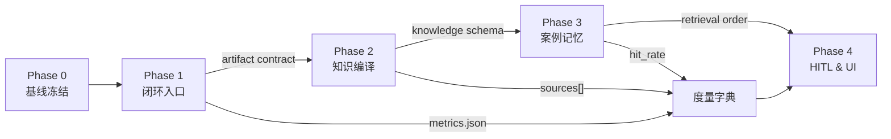

# BestQ-A 开发作业（基于 external 参考仓抽取）

日期：2026-04-13
状态：execution-level（工作作业，非稳定契约）

> **文档职责分工**：
> - 稳定路线图与 Phase 门控 → [../../docs/bestqa-roadmap.md](../../docs/bestqa-roadmap.md)
> - 产物、schema、写入路径等具体契约 → `docs/current/*-contract.md`
> - 本文件只承载**执行步骤、target files、验证命令**等作业层内容；schema 若与 `docs/current/` 冲突，以 `docs/current/` 为准

依赖文档：
- [../../docs/bestqa-roadmap.md](../../docs/bestqa-roadmap.md) — 路线总纲（Phase 0–4）
- [../../docs/external-integration.md](../../docs/external-integration.md) — external 仓库 SSOT 边界（**硬约束**）
- [../../docs/current/artifact-contract.md](../../docs/current/artifact-contract.md) — Phase 1 产物合同
- [../../docs/current/metrics-contract.md](../../docs/current/metrics-contract.md) — 度量字典
- [../../docs/current/knowledge-source-contract.md](../../docs/current/knowledge-source-contract.md) — Phase 2 知识库合同
- [../../docs/current/memory-layer-contract.md](../../docs/current/memory-layer-contract.md) — Phase 3 记忆分层合同
- [../../docs/current/architecture-overview.md](../../docs/current/architecture-overview.md) — 四层架构
- [../../docs/bestqa_benchmark_design.md](../../docs/bestqa_benchmark_design.md) — SWE-bench 集成设计

## SSOT 对齐声明

本规划的所有外部能力吸收**必须**符合 `docs/external-integration.md` 的仓库登记表与冲突裁决：

- **记忆层** = causal-learner SQLite（结构化 facts / events / regulations） + SimpleMem（语义原文记忆），**二者不得重复存储原文**。
- **多 agent 编排** = OMC（`/team`、`ultrawork`、`ralph`），**aiwg 只作为模式参考，不部署运行时、不新建 `.aiwg/` 目录**。
- **知识库源文件** = `docs/knowledge_base/`（BestQ-A 仓内），llm_wiki 只生成只读视图。
- **composites 解法树** = BestQ-A 仓内产物，AutoResearchClaw 只产草稿并经人审。

若本规划的任何 Implementation Step 与上述 SSOT 冲突，以 SSOT 为准，并同步更新本规划。

## Requirements Summary

BestQ-A 当前已经具备较强的内核能力，但尚未形成稳定的产品闭环。

当前仓库已经明确了四层架构、Pipeline、Graph、Evidence、Hypothesis、DualStorage 等核心抽象，说明项目不是“从零开始”，而是“内核先行、产品层滞后”：

- 四层架构与模块依赖已定义，见 `docs/current/architecture-overview.md:7-34` 与 `docs/current/architecture-overview.md:96-120`
- SWE-bench 集成设计已经存在，但 BestQA 侧仍停留在“扫描 Markdown + 关键词匹配”的 Lite 原型，见 `docs/bestqa_benchmark_design.md:3-6` 与 `docs/bestqa_benchmark_design.md:26-35`
- MCP 服务可构建，但工程脚本面极薄，目前只有 `build/dev/start`，见 `causal-learner/mcp-server/package.json:7-10`
- 长期记忆当前主要是 regulation 级别的加载与 flush，仍不是 case / lesson / solution tree 级别的跨 session 记忆，见 `causal-learner/mcp-server/src/core/dual-storage.ts:4-17` 与 `causal-learner/mcp-server/src/core/dual-storage.ts:115-139`

对比 `external` 后，最值得吸收的不是单个仓库整体迁移，而是以下能力层：

- `external/aiwg/README.md:31-37` 与 `external/aiwg/README.md:75-130`
  说明应补齐结构化记忆、质量闸门、闭环验证、可持续执行路径
- `external/SimpleMem/README.md:154-160`
  说明应从“规则记忆”升级到“可检索长期经验记忆”
- `external/llm_wiki/README.md:95-123` 与 `external/llm_wiki/README.md:186-219`
  说明应把知识库从静态文档升级为“可编译、可缓存、可追踪来源、可扩展检索”的资产
- `external/AutoResearchClaw/README.md:96-116` 与 `external/AutoResearchClaw/README.md:169-180`
  说明应提供统一入口、标准产物、验证报告、复盘资产与 HITL 机制

## Planning Principles

1. 先补产品闭环，再继续堆内核抽象。
2. 先补验证和基线，再做大规模能力扩展。
3. 优先复用现有 Graph / Evidence / DualStorage，不新造平行体系。
4. 规划必须服务后续落地，避免继续增加只在文档中存在的层。
5. 每个阶段都要输出可验证产物，而不是只有“设计完成”。

## Decision Drivers

1. 当前最薄弱的是统一入口、验证与产物组织，而不是底层算法完全缺失。
2. 当前 BestQA 检索方案过于原型化，无法支撑真实 benchmark 和后续扩展。
3. 当前长期记忆粒度偏粗，不足以支撑“最佳问题/最佳答案/最佳路径”沉淀。

## Viable Options

### Option A: 继续强化内核，暂缓产品化

优点：
- 能继续深化因果图、RefAlgebra、Pattern 等理论部分

缺点：
- 无法解决当前“能跑但难用、难验证、难演进”的主要瓶颈
- 会继续扩大“文档设计领先于工程入口”的差距

结论：
- 不选。它强化的是当前已经相对强的部分，不是短板

### Option B: 先做产品闭环与验证层，再扩展知识库与记忆

优点：
- 最快把已有能力转成可演示、可评估、可持续演进的系统
- 与 external 中最成熟的仓库模式最一致

缺点：
- 前两阶段新增的“工程面”工作较多，短期内算法可见进展较少

结论：
- 选择此路线

### Option C: 直接做 UI / 可视化工作台

优点：
- 可见度高，易展示

缺点：
- 在统一入口、评测、知识编译、记忆模型不稳定前，容易把脆弱内核包装成更复杂产品

结论：
- 仅作为后置阶段，不作为起步路线

## ADR

### Decision

采用“先闭环、后扩展”的四阶段路线：先统一入口与验证，再升级知识库编译与记忆模型，最后补可视化与 HITL。

### Drivers

- 现有内核能力已足以支撑第一轮产品收束
- 现有 repo 缺统一入口与标准产物
- external 参考仓的成熟点都集中在闭环、记忆、检索和验证

### Alternatives Considered

- 继续优先做算法内核增强
- 直接开始做桌面 UI / 图形工作台

### Why Chosen

因为当前最缺的是“把已有能力变成稳定可用系统”的工程面；若不先补这层，后续知识库、记忆和 UI 的投入都会落在不稳定底座上。

### Consequences

- 前两阶段会偏工程基础设施与开发体验
- 第三阶段开始才会显著改变 BestQA 的知识质量与回答质量
- 第四阶段才适合做面向用户的交互面

### Follow-ups

- 执行 Phase 1 时同步定义 artifact contract
- 执行 Phase 2 时冻结 knowledge-base schema
- 执行 Phase 3 时统一 regulation memory 与 case memory 的边界

## Phased Plan

| Phase | 目标 | 核心结果 | 优先级 | 依赖 |
|---|---|---|---|---|
| Phase 0 | 基线冻结与度量采集 | baseline report、运行时快照、测试清单 | P0 | — |
| Phase 1 | 建立统一入口和验证闭环 | 可运行的 root workflow、CI、标准评测产物 | P0 | Phase 0 |
| Phase 2 | 把 BestQA 从 Lite 检索升级为可编译知识库 | 两段式 ingest、来源追踪、缓存、可扩展检索 | P0 | Phase 1 的 artifact contract |
| Phase 3 | 升级长期记忆为案例与解法记忆 | case memory、lesson ledger、solution tree 复用 | P1 | Phase 2 的 schema 冻结 |
| Phase 4 | 补交互与审查机制 | dashboard / review queue / HITL | P2 | Phase 3 的 memory retrieval order |

### 阶段依赖图

**关键约束**：每个箭头代表"上游产物**冻结**后下游才能开始"。若上游未冻结就开工，下游必须停工并回到上游补齐。

## Phase 0: 基线冻结与度量采集

### Goal

在改动任何代码前，先把"今天 BestQ-A 能做什么、跑出什么数"固化成 baseline，作为后续阶段的对照基线。

### Why First

- 没有 baseline 就没法证明 Phase 1–4 的改进是有效的还是有害的
- 现有测试已能跑（`test-basic.mjs`、`test-v6-algebra.mjs`、`test-new-modules.mjs`），但**没有统一的结果归档位置**

### Implementation Steps

1. 运行现有全部测试，把输出归档到 `.omx/baselines/2026-04-13/`
2. 采集 causal-learner 的 stats 快照（`get_stats`、`graph_stats`、`get_longterm_stats`）
3. 在空库上跑一次 SWE-bench Lite 子集（10 条），归档 `baseline-swebench.json`
4. 列出当前测试覆盖的模块矩阵，标出未覆盖的 hotspot

### Acceptance Criteria

- `.omx/baselines/2026-04-13/` 存在且包含 `tests.log`、`stats.json`、`swebench-10.json`、`coverage-matrix.md`
- baseline 里的每个数值都能在后续阶段被引用做对比

### Exit Criteria（未达成则不进 Phase 1）

- baseline 测试 100% 可重现（同一命令两次跑得同样结果）
- baseline SWE-bench 子集的 solve_rate、mean_tree_depth、context_chars 三个度量已记录

## Phase 1: 产品闭环与验证面

### Goal

把当前项目从“多个脚本 + 一个 MCP 内核”收束为一个可重复执行、可验证、可交付的工程入口。

### Why Now

- 当前根 README 只有一句话，见 `README.md:1-2`
- 当前 Node 工程脚本过少，见 `causal-learner/mcp-server/package.json:7-10`
- 根目录不存在自己的 `.github` CI 目录

### Implementation Steps

1. 建立根级运行入口
   - 新增根级 `README` 的产品化说明、quick start、架构索引、评测方式
   - 增加 root scripts 或统一命令入口，例如 `run`, `eval`, `report`, `bench`
2. 建立标准验证路径
   - 把现有测试脚本收口为标准命令
   - 至少覆盖 build、核心回归、v6 algebra、新模块回归
3. 建立 CI
   - 新增 `.github/workflows/ci.yml`
   - 在 PR / push 上跑 build + smoke tests
4. 定义标准产物目录
   - 统一输出到 `artifacts/` 或 `.omx/runs/`
   - 固定生成 `metrics.json`, `summary.md`, `verification_report.json`
5. 建立 root-level benchmark contract
   - 把 `scripts/evaluate.mjs`, `scripts/swebench-train-test.mjs`, `scripts/swebench-evaluate.mjs` 纳入统一工作流

### Target Files

- `README.md`
- `.github/workflows/ci.yml`
- `causal-learner/mcp-server/package.json`
- `causal-learner/mcp-server/tests/*`
- `causal-learner/mcp-server/scripts/*`
- 新增根级工作流脚本或配置文件

### Acceptance Criteria

- 仓库根 README 能说明“项目是什么、怎么跑、怎么评测、输出什么”
- 有一个统一命令能完成最小闭环
- CI 自动执行 build + 核心测试
- 每次评测都能生成结构化结果产物

### Verification

- 本地执行统一命令并产生产物
- CI 成功
- 对现有 build 与三类测试形成可重复封装

### Artifact Contract

产物目录结构、`metrics.json` 字段、失败语义、清理规则均由 [../../docs/current/artifact-contract.md](../../docs/current/artifact-contract.md) 裁决。本作业的 target files 必须严格对齐该合同，不得在此处重复定义 schema。

### Exit Criteria（未达成则不进 Phase 2）

- 根级 `README.md` 替换完成，statement 从 1 行变为"是什么/怎么跑/怎么评测/产物"四段
- 存在一条**单命令**能产出完整 `artifacts/<run_id>/` 且所有必填字段非空
- CI 在 push / PR 自动触发并必须能在一次失败后自愈（重跑即过，无 flaky）

### Rollback Criteria

- 若 CI 引入后连续 3 次 flaky → 立即禁用该 workflow，退回手工 baseline，不阻塞 Phase 2 启动
- 若 artifact schema 在 Phase 1 结束前仍在变化 → 推迟 Phase 2 启动，冻结为先

## Phase 2: BestQA 知识库编译层

### Goal

把 `docs/knowledge_base` 从“被扫描的 Markdown”升级为“被编译的知识资产”。

### Why Now

- 当前 BestQA 方案仍是 Lite 检索，见 `docs/bestqa_benchmark_design.md:26-35`
- 当前架构已经有 Graph / Pattern / Evidence，可承接编译式知识资产，见 `docs/current/architecture-overview.md:31-34` 与 `docs/current/architecture-overview.md:98-110`
- `external/llm_wiki` 已证明两段式 ingest、来源追踪、增量缓存、检索扩展是有效路线，见 `external/llm_wiki/README.md:95-123` 与 `external/llm_wiki/README.md:186-219`

### Implementation Steps

1. 定义 knowledge source schema
   - 统一 frontmatter 字段，例如 `problem_class`, `intent`, `signals`, `tree`, `sources`
2. 实现两阶段 ingest
   - Stage A: source analysis
   - Stage B: compiled artifact generation
3. 引入增量缓存
   - 基于文件 hash 跳过未变更内容
4. 构建检索层
   - 先做 lexical + graph expansion
   - 后续将 vector retrieval 作为可选能力
5. 把检索结果映射到 BestQA solution tree
   - 输出结构化 plan / tree，而不是只返回原始片段

### Target Files

- `docs/knowledge_base/**`
- 新增 `causal-learner/mcp-server/src/core/knowledge-ingest.ts`
- 新增 `causal-learner/mcp-server/src/core/knowledge-index.ts`
- 新增或扩展 `causal-learner/mcp-server/src/tools/search.ts`
- `docs/bestqa_benchmark_design.md`

### Acceptance Criteria

- 至少一类知识库文档可被编译成结构化索引
- 检索结果包含来源、结构化 tree、匹配原因
- 知识库变更后支持增量更新
- SWE-bench 注入上下文不再依赖纯关键词匹配

### Verification

- 固定样例知识库可成功 ingest
- 对同一问题能输出稳定的 solution tree
- 修改单个知识文件后，增量更新可见

### Knowledge Source Schema 与 Ingest Pipeline

frontmatter 强制字段、Stage A/B 管线、缓存规则、`kb_*` 表边界、外部来源禁区均由 [../../docs/current/knowledge-source-contract.md](../../docs/current/knowledge-source-contract.md) 裁决。本作业的 Implementation Steps 必须对齐该合同；若实现中发现合同缺项，先改合同再改代码。

### Exit Criteria（未达成则不进 Phase 3）

- 至少 10 个 composites 节点完成编译，每个节点可通过 `id` 检索到
- 修改任一 composites 文件后，增量 ingest 只重编译该文件（可通过 log 验证）
- `metrics.json` 新增 `kb_nodes_total`、`kb_compile_duration_sec` 字段

### Rollback Criteria

- 若 Stage B 的写入打破 regulation 表结构 → 立刻回滚并把 `kb_*` 表移到独立 db 文件
- 若 frontmatter schema 在 Phase 2 结束前被反复修改 → 停止 ingest，回到 Lite 检索，直到 schema 冻结

## Phase 3: 案例记忆与经验沉淀

### Goal

把长期记忆从 regulation 记忆升级为 case / lesson / solution-path 记忆。

### Why Now

- 当前 `DualLayerStorage` 主要围绕 regulation 的 relevant loading，见 `causal-learner/mcp-server/src/core/dual-storage.ts:115-139`
- `external/SimpleMem` 的经验是：长期记忆要能存、索引、检索可复用经验，而不是只存规则，见 `external/SimpleMem/README.md:154-160`
- `external/AutoResearchClaw` 的经验是：每轮运行都要留下 decision / finding / review / evolution 产物，见 `external/AutoResearchClaw/README.md:102-111` 与 `external/AutoResearchClaw/README.md:171-180`

### Implementation Steps

1. 定义 case memory schema
   - 问题表述
   - 环境上下文
   - 失败信号
   - 候选路径
   - 最终解法树
   - 证据与结果
2. 扩展 dual storage
   - regulation store
   - case store
   - lesson ledger
3. 实现 retrieval strategy
   - 先查 case memory
   - 再查 regulation memory
   - 最后查知识库
4. 记录 run-level lessons
   - benchmark 失败原因
   - 检索缺口
   - 错误树与修复树

### Target Files

- `causal-learner/mcp-server/src/core/dual-storage.ts`
- 新增 `causal-learner/mcp-server/src/core/case-memory.ts`
- 新增 `causal-learner/mcp-server/src/core/lesson-ledger.ts`
- `causal-learner/mcp-server/src/tools/swebench.ts`

### Acceptance Criteria

- 同类问题第二次出现时可命中既有 case / tree
- 长期记忆可区分规则、案例、经验教训
- benchmark 运行后能留下可检索的 lessons

### Verification

- 构造重复问题集验证 memory hit
- 检查 case retrieval 是否提升 tree 质量或上下文质量

### Retrieval Order 与存储职责边界

五类存储（regulation / case / lesson / kb / SimpleMem）的职责、写入禁区、统一检索的串行顺序、指纹算法约束均由 [../../docs/current/memory-layer-contract.md](../../docs/current/memory-layer-contract.md) 裁决。本作业的 `case_memory.ts` / `lesson-ledger.ts` / `retrieval.ts` 实现必须严格对齐该合同；越界写入在 code review 阶段必须 revert。

### Exit Criteria（未达成则不进 Phase 4）

- 重复问题集上 `case_memory.hit_rate ≥ 0.6`
- `retrieval order` 的每层命中率都被 metrics.json 记录
- case / regulation / lesson 三者边界在 code review 中零越界

### Rollback Criteria

- 若 case_memory 与 regulation_store 出现职责越界写入 → 立即冻结 Phase 3，补写迁移脚本把越界数据搬回正确表
- 若 retrieval order 的总延迟 > baseline 的 2 倍 → 暂停推广，先做 layer 级 profiling

## Phase 4: 交互面、审查和 HITL

### Goal

在闭环、知识编译、记忆体系稳定后，再补 dashboard、review queue 和人机协作层。

### Why Later

- 交互层不是当前主瓶颈
- 在底层契约未稳定前做 UI，返工成本高

### Implementation Steps

1. 做轻量 dashboard
   - graph stats
   - open knowledge gaps
   - top reusable trees
2. 做 review queue
   - 待人工确认的规则晋升
   - 待人工确认的 solution tree
3. 做 HITL 模式
   - auto
   - review-required
   - co-pilot

### Target Files

- `causal-learner/visualization/dashboard.html`
- 新增 review / workflow 相关模块
- 新增 run report 页面或静态站点

### Acceptance Criteria

- 用户能看到当前知识图、缺口和高价值 tree
- 人工可审核关键晋升点
- 自动与协作模式可切换

### Verification

- 本地 dashboard 可打开并消费真实运行产物
- review queue 能回写状态

## 度量字典

字段定义、类型、引入 Phase、采集方式、冻结/废弃流程均由 [../../docs/current/metrics-contract.md](../../docs/current/metrics-contract.md) 裁决。本作业只消费字典，不在此处新增字段。

## Risks and Mitigations

| Risk | Impact | Mitigation |
|---|---|---|
| 再次只增加文档层，不落工程入口 | 高 | Phase 1 必须先做统一命令和 CI |
| 知识库 schema 反复变化 | 高 | 在 Phase 2 先冻结 frontmatter contract |
| case memory 与 regulation memory 发生职责重叠 | 中 | 在 Phase 3 先写边界文档和 retrieval order |
| UI 过早启动导致返工 | 中 | 明确 UI 仅 Phase 4 启动 |
| benchmark 指标缺乏可比性 | 高 | Phase 1 定义固定产物和统一评测命令 |
| 外部仓库能力被重复吸收导致两套实现 | 高 | 所有吸收先查 `docs/external-integration.md` SSOT，冲突裁决条款禁止越界 |
| 度量 schema 漂移使前后 Phase 不可对比 | 高 | 度量字典冻结字段名与结构位置，新增走 ADR |
| Phase 间越界开工（上游未冻结） | 中 | 每阶段有明确 Exit Criteria，未达成则下游停工 |

## Verification Steps

1. 基线验证
   - `npm run build`
   - `node tests/test-basic.mjs`
   - `node tests/test-v6-algebra.mjs`
   - `node tests/test-new-modules.mjs`
2. Phase 1 验证
   - CI 绿灯
   - 统一命令生成标准产物
3. Phase 2 验证
   - knowledge ingest / cache / retrieval 可复现
4. Phase 3 验证
   - case memory hit rate 有可观测提升
5. Phase 4 验证
   - dashboard / review 流程可使用真实数据

## Recommended Execution Order

1. 先做 Phase 1
2. Phase 1 稳定后再做 Phase 2
3. Phase 2 的 schema 稳定后再做 Phase 3
4. 只有当前三阶段稳定，才进入 Phase 4

## Changelog

- 2026-04-13 初版：来自对当前仓库与 `external/aiwg`, `external/SimpleMem`, `external/llm_wiki`, `external/AutoResearchClaw` 的对比抽取，明确“先闭环、后扩展”路线
- 2026-04-13 v2 补强：
  - 新增 **SSOT 对齐声明**，与 `docs/external-integration.md` 硬绑定
  - 新增 **Phase 0 基线冻结**，作为所有后续阶段的对照基线
  - Phase 1 补 **Artifact Contract**（目录结构 + metrics.json 最小字段集）
  - Phase 2 补 **Knowledge Source Frontmatter schema** 和 **Ingest Pipeline 契约**
  - Phase 3 补 **Retrieval Order** 与 **存储职责边界表**
  - 新增 **阶段依赖图**（mermaid）
  - 新增 **度量字典** 章节，字段按 Phase 引入冻结
  - 每个 Phase 补 **Exit Criteria** 与 **Rollback Criteria**
  - Risks 表扩充 3 条（SSOT 越界 / 度量漂移 / 阶段越界开工）
- 2026-04-13 v3 契约迁移：
  - 具体 schema 与写入路径全部迁移到 `docs/` 下的稳定合同文档，本作业收敛为"执行作业层"
  - 新增 [../../docs/bestqa-roadmap.md](../../docs/bestqa-roadmap.md) 作为稳定路线图
  - 新增 [../../docs/current/artifact-contract.md](../../docs/current/artifact-contract.md)
  - 新增 [../../docs/current/metrics-contract.md](../../docs/current/metrics-contract.md)
  - 新增 [../../docs/current/knowledge-source-contract.md](../../docs/current/knowledge-source-contract.md)
  - 新增 [../../docs/current/memory-layer-contract.md](../../docs/current/memory-layer-contract.md)
  - 本作业内 Phase 1/2/3 的内联 schema 块全部替换为指向 `docs/current/` 的链接，避免双源真相
