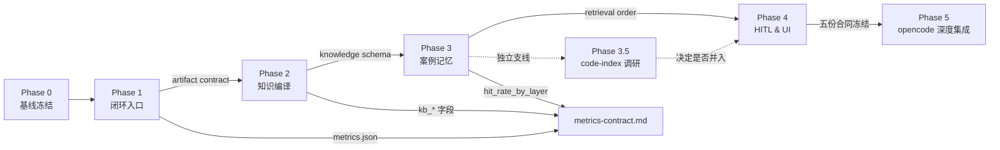

# BestQ-A 开发路线图（Phase 0–4）

> 本文档是 BestQ-A "先闭环、后扩展" 路线的总纲，串起四个阶段的目标、产物契约与验收。
> 所有**具体 schema 与写入路径**都迁移到 `current/` 下的单项合同文档；本文只做编排与阶段门控。
> 设计基底：[causal-learner-design.md](causal-learner-design.md)、[bestqa_benchmark_design.md](bestqa_benchmark_design.md)、[mcp_implementation_plan.md](mcp_implementation_plan.md)
> 边界基底：[external-integration.md](external-integration.md)
> 执行作业：[../.omx/plans/bestqa-roadmap-from-external-2026-04-13.md](../.omx/plans/bestqa-roadmap-from-external-2026-04-13.md)

---

## 1. 路线选择

BestQ-A 现在**内核先行、产品层滞后**：四层架构、Pipeline、Graph、Evidence、Hypothesis、DualStorage 等抽象都已在 `current/` 下有合同，但统一入口、评测产物、知识编译、案例记忆还没到位。

对比 [external-integration.md](external-integration.md) 登记的六个参考仓，得出：**优先补闭环，不优先堆内核**。

| 选项 | 结论 |
|------|------|
| A 继续强化内核抽象 | 不选。强化的是已相对强的部分，不是短板 |
| B 先补闭环与验证，再扩知识库与记忆 | **选**。与 external 成熟仓库的闭环/记忆/检索/验证模式一致 |
| C 直接做 UI / 可视化工作台 | 仅作 Phase 4，不作起步 |

---

## 2. 阶段总览

| Phase | 目标 | 核心产物 | 依赖的合同文档 |
|-------|------|----------|----------------|
| **Phase 0** | 基线冻结 | `.omx/baselines/<date>/` 下的 tests、stats、swebench 快照 | [current/metrics-contract.md](current/metrics-contract.md) |
| **Phase 1** | 闭环入口 | 根 README、统一命令、CI、标准 artifacts | [current/artifact-contract.md](current/artifact-contract.md)、[current/metrics-contract.md](current/metrics-contract.md) |
| **Phase 2** | 知识编译 | 两段式 ingest、composites 编译索引、来源追踪 | [current/knowledge-source-contract.md](current/knowledge-source-contract.md)、[current/compile-promotion-contract.md](current/compile-promotion-contract.md) |
| **Phase 3** | 案例与经验记忆 | case_memory、lesson_ledger、统一 retrieval order | [current/memory-layer-target.md](current/memory-layer-target.md)（辅：[current/memory-layer-current.md](current/memory-layer-current.md)） |
| **Phase 3.5** | code-index 可行性调研（独立支线） | 调研报告 + PoC + 是否纳入 Phase 4 的决定 | 暂无（调研产物） |
| **Phase 4** | HITL 与可视面 | dashboard、review queue、markdown-viewer 视图资产、auto/co-pilot 切换 | 暂无，待 Phase 3 冻结后补 |
| **Phase 5** | opencode 深度集成（长期目标） | bestqa opencode plugin、MCP + plugin 双通道 | 需新增 `plugin-surface-contract.md` |

### 阶段依赖图

**Phase 3.5 为可选支线**：不在主关键路径上，可与 Phase 3 末期并行；若调研结论为"接入"，其产物会在 Phase 4 合并；若结论为"暂缓"，主线不受影响。

**门控原则**：箭头代表"上游产物**冻结**后下游才能开始"。未冻结就开工，下游必须停工回到上游补齐。

---

## 3. 每阶段门控

### Phase 0：基线冻结 ✅ CLOSED (2026-04-13)

| 维度 | 内容 |
|------|------|
| Goal | 改代码前固化"今天 BestQ-A 能做什么、跑出什么数" |
| Produces | `.omx/baselines/2026-04-13/` 已落盘：`commit.txt` / `tests.log`（5 test ok）/ `stats.json`（5 真字段）/ `coverage-matrix.md`（24 src scanned）/ `summary.md` |
| Capture | `scripts/capture-baseline.mjs` + `causal-learner/mcp-server/scripts/dump-stats.mjs`（真实调用 4 类 stats 工具） |
| Exit | ✅ baseline 可重现；✅ stats 采集 status=OK；⚠️ solve_rate / mean_tree_depth 留待 Phase 1 的 `scripts/eval.mjs` 绑定数据集后采集 |
| Rollback | 无；若 baseline 不可重现，停工排查 |

### Phase 1：闭环入口 🟡 STARTED (2026-04-13)

| 维度 | 内容 |
|------|------|
| Goal | 从"多脚本 + MCP 内核"收束为一个可重复执行、可验证的入口 |
| Produces | `scripts/eval.mjs`（首个入口脚本，已跑通）、`artifacts/20260413-001/`（首个真实 run，6 文件 / 34 metrics 字段）、`.github/workflows/ci.yml`（build + test + contract-truth-check 三 job） |
| 合同 | [current/artifact-contract.md](current/artifact-contract.md) + [current/metrics-contract.md](current/metrics-contract.md) + [current/contract-audit-contract.md](current/contract-audit-contract.md) |
| Exit | ✅ 单命令跑通 `node scripts/eval.mjs` 产出完整 `artifacts/<run_id>/`；✅ contract-audit 0 error；❌ 根 README 四段式未写；❌ solve_rate 绑定真实 SWE-bench 数据集未落地 |
| Rollback | CI flaky ≥ 3 次则禁用该 workflow 回手工 baseline；schema 未冻结则推迟 Phase 2 |

### Phase 2：知识编译

| 维度 | 内容 |
|------|------|
| Goal | `docs/knowledge_base/composites/` 从被扫描升级为被编译的资产 |
| Produces | frontmatter schema 冻结、两段式 ingest 管线、`kb_*` 表 |
| 合同 | [current/knowledge-source-contract.md](current/knowledge-source-contract.md) |
| Exit | ≥ 10 个 composites 可检索；增量 ingest 只重编译改动文件；`kb_nodes_total` 写入 metrics |
| Rollback | `kb_*` 破坏 regulation 表结构 → 移到独立 db；schema 反复变动 → 停 ingest 回 Lite |

### Phase 3：案例与经验记忆

| 维度 | 内容 |
|------|------|
| Goal | 把 regulation-only 记忆升级为 case / regulation / kb / raw-text 四位一体 |
| Produces | `case_memory`、`lesson_ledger`、统一 retrieval order |
| 合同 | [current/memory-layer-target.md](current/memory-layer-target.md)（主）+ [current/memory-layer-current.md](current/memory-layer-current.md)（辅） |
| Exit | 重复问题集 `case_memory.hit_rate ≥ 0.6`；每层命中记录进 metrics；存储边界零越界 |
| Rollback | 职责越界写入 → 冻结 Phase 3 写迁移脚本；retrieval 延迟超 baseline 2 倍 → layer profiling |

### Phase 3.5：code-index 可行性调研（独立支线）

| 维度 | 内容 |
|------|------|
| Goal | 判断 GrapeRoot (Codex-CLI-Compact) 式的"代码语义图谱 → prompt context 预加载"是否应纳入 BestQ-A 作为 `kb_*` 之外的第 6 类存储 |
| Produces | `docs/design_history/code-index-feasibility-<date>.md` 调研报告 + 极小 PoC |
| 合同 | 若结论为"接入"，必须先扩 [current/memory-layer-target.md](current/memory-layer-target.md) 的存储层表为六类，再改代码 |
| Exit | 有明确"接入 / 暂缓 / 拒绝"三选一结论，并标注触发下一轮调研的条件 |
| Rollback | 支线性质，主线不受影响；若 PoC 破坏 Phase 3 的 retrieval order 必须立即撤回 |

### Phase 4：HITL 与可视面

| 维度 | 内容 |
|------|------|
| Goal | 上层交互：dashboard、review queue、auto / review-required / co-pilot 切换 |
| Produces | `causal-learner/visualization/dashboard.html` 消费真实产物、review 可回写状态、markdown-viewer/skills 生成的图表资产（落到 `website/` 或 `artifacts/<run_id>/`） |
| 合同 | 视图资产通道受 [external-integration.md](external-integration.md) 冲突 E 约束，禁止生成 `docs/current/` 下的合同文档 |
| Exit | 用户能看到知识图、缺口、高价值 tree；人工可审核关键晋升点 |
| Rollback | 内核契约未稳定则不进 Phase 4，宁可延后 |

### Phase 5：opencode 深度集成（长期目标）

| 维度 | 内容 |
|------|------|
| Goal | 把 causal-learner + knowledge_base + BestQA 检索以**opencode plugin** 形态分发，参照 `external/oh-my-openagent`<!-- audit-ignore: missing-file: external/oh-my-openagent (gitignored, 见 external-integration.md 登记表 #13) --> 的集成深度；不放弃现有 Claude Code MCP 通道，形成"MCP + plugin"双通道 |
| Produces | `packages/bestqa-opencode-plugin/`（或等价目录），实现 opencode 的 plugin API：tool 注册 / context 注入 hook / session 生命周期绑定 |
| 前置条件 | Phase 1–4 的五份合同全部稳定，特别是 [current/artifact-contract.md](current/artifact-contract.md) 与 [current/memory-layer-current.md](current/memory-layer-current.md) / [current/memory-layer-target.md](current/memory-layer-target.md) 已冻结；否则 plugin 会踩到后续 schema 变动 |
| 合同 | 需新增 `docs/current/plugin-surface-contract.md`（尚未创建），约束双通道（MCP / plugin）之间的 SSOT 与状态共享 |
| Exit | 在 opencode session 内能通过 plugin 调用 causal-learner 核心能力（submit_observation / retrieve / recordFix），且与 MCP 通道的状态一致 |
| Rollback | 若 opencode plugin API 有破坏性变更 → 回退到 MCP 单通道，不阻塞主线 |

**为什么放到 Phase 5 而不是现在**：
- 现在接 opencode 等于在不稳定的内核上再加一层不稳定的分发面，两头返工
- opencode plugin API 本身在快速演进，锁定太早风险大
- Phase 1–4 完成后 BestQ-A 才有"可分发的东西"，先稳住内核再谈分发

**与 oh-my-openagent 的关系**：
- oh-my-openagent 是 opencode 生态的"OMC 等价物"，提供 agent 编排层
- BestQ-A 的定位是**领域 intelligence 层**（因果 / 案例 / 解法树），不是 agent 编排层，两者正交可共存
- 长期看，BestQ-A 可以作为 oh-my-openagent 生态中的一个"领域知识插件"被消费

---

## 4. 风险台账

| 风险 | 影响 | 缓解 |
|------|------|------|
| 再次只增文档不落工程入口 | 高 | Phase 1 必须先做统一命令和 CI |
| 知识库 schema 反复变动 | 高 | Phase 2 内 frontmatter 冻结才能进 Phase 3 |
| case_memory 与 regulation_store 职责越界 | 中 | [current/memory-layer-current.md](current/memory-layer-current.md) §1 + [current/memory-layer-target.md](current/memory-layer-target.md) §1 为唯一裁决 |
| 外部仓库能力被重复吸收 | 高 | 所有吸收先查 [external-integration.md](external-integration.md) 的 SSOT |
| 度量 schema 漂移 | 高 | [current/metrics-contract.md](current/metrics-contract.md) 冻结字段名与位置 |
| 阶段越界开工 | 中 | 每阶段有 Exit Criteria，未达成则下游停工 |
| UI 过早启动 | 中 | Phase 4 才启动 |

---

## 5. 与既有设计的承接关系

| 既有文档 | 与本路线的关系 |
|----------|----------------|
| [causal-learner-design.md](causal-learner-design.md) | 定义三层数据流（observation / event / regulation），Phase 3 的 case_memory 是它的水平扩展，不替代 |
| [bestqa_benchmark_design.md](bestqa_benchmark_design.md) | 定义 SWE-bench 集成思路，Phase 1 把它从 Lite 原型升级为可重复的 artifact 契约；Phase 2 把 "扫 Markdown + 关键词" 替换为编译式检索 |
| [mcp_implementation_plan.md](mcp_implementation_plan.md) | 定义 MCP Server 骨架，Phase 1 的统一命令入口复用它，Phase 3 的 retrieval order 作为其 `search_*` 工具的内部实现 |
| [current/pipeline-contract.md](current/pipeline-contract.md) | Phase 3 的 `recordFix` 写入路径在此合同内追加 case_memory / lesson_ledger 两步，不破坏现有流程 |
| [current/compile-promotion-contract.md](current/compile-promotion-contract.md) | Phase 2 的 Stage B 编译写入不与该合同重名，`kb_*` 表与 regulation 强化路径正交 |
| [external-integration.md](external-integration.md) | 全局边界，所有 Phase 的外部能力吸收必须遵守 |

---

## 6. 执行作业与本路线图的关系

- **本文档**：稳定路线图，变更频率低，改动需要 ADR
- **[.omx/plans/bestqa-roadmap-from-external-2026-04-13.md](../.omx/plans/bestqa-roadmap-from-external-2026-04-13.md)**：执行作业，含具体 step-by-step、target files、verification 脚本；可以频繁迭代

两者矛盾时以本文档为准。作业里若出现超出合同的字段或写入路径，必须先更新合同文档再改代码。
