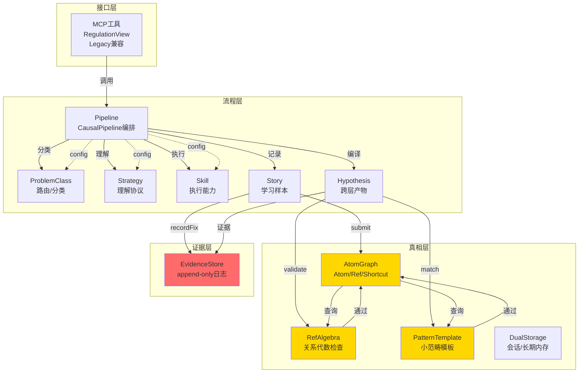
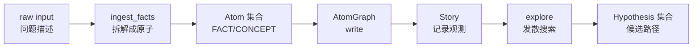
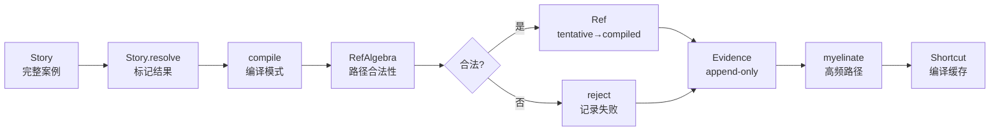
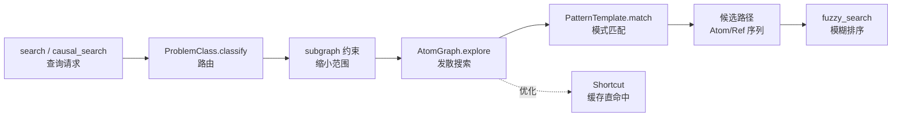
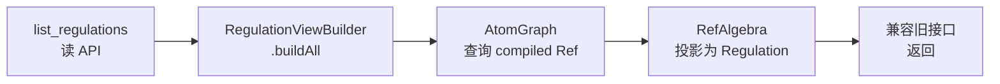
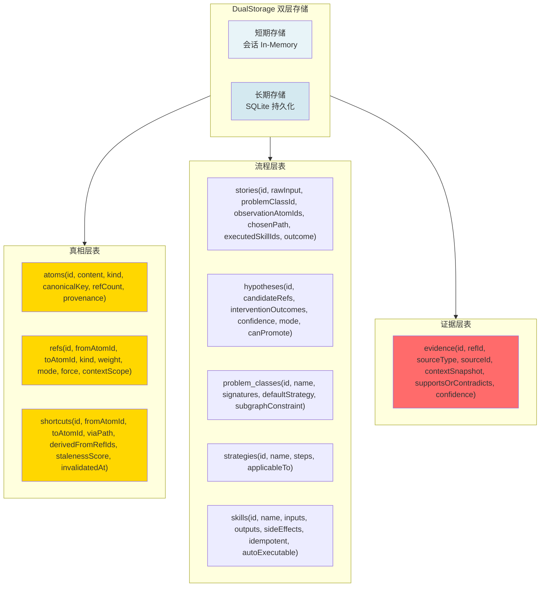
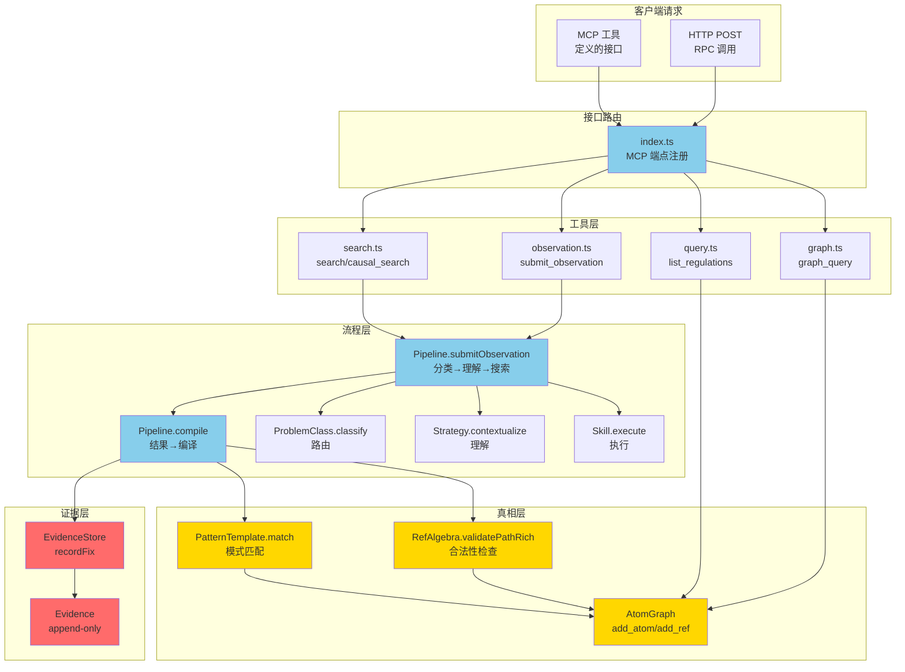

# BestQ-A 架构总览

> 本文讲"模块怎么连、读写路径怎么走"。语义约束见 [`metamodel.md`](metamodel.md)，复合规则见 [`ref-algebra-contract.md`](ref-algebra-contract.md)。

---

## 1. 四层架构

```
接口层（Interface）
    ↓
Pipeline / MCP 工具 / Legacy Regulation 兼容
    ↓
流程层（Process）
    ↓
Pipeline / Story / Hypothesis / ProblemClass / Strategy / Skill
    ↓
真相层（Ground Truth）
    ↓
AtomGraph (Atom/Ref/Shortcut) / RefAlgebra / PatternTemplate
    ↓
证据层（Evidence）
    ↓
Evidence (append-only 不可篡改日志)
```

### 层级说明

| 层级 | 职责 | 特征 |
|------|------|------|
| **接口层** | 暴露 MCP 工具、HTTP/RPC 接口、兼容旧 Regulation API | 多态适配 |
| **流程层** | 运行时推理闭环：分类→理解→约束→搜索→执行→编译 | 编排状态机 |
| **真相层** | 知识图谱、关系代数、模式模板——系统的单一事实源 SSOT | 永久存储 |
| **证据层** | 所有因果声明的支撑依据，审计日志，不可篡改 | append-only |

---

## 2. 模块依赖图



### 核心依赖关系

```
Pipeline（编排中枢）
  ├─ ProblemClass（路由）
  ├─ Strategy（理解协议）
  ├─ Skill（执行）
  ├─ Story（学习样本）
  └─ Hypothesis（跨层产物）
       ├─ AtomGraph（图查询/更新）
       │    ├─ RefAlgebra（路径合法性检查）
       │    └─ Shortcut（编译缓存）
       ├─ PatternTemplate（模式匹配）
       ├─ EvidenceStore（记录证据）
       └─ DualStorage（会话/长期存储）

RegulationViewBuilder（只读投影）
  └─ AtomGraph.db（查询已编译 Ref）

FuzzyMatcher（模糊搜索）
  └─ Regulation / Event 表

MonteCarloSampler（大文档采样）
  └─ 独立算法模块

ReactSearch（ReAct 搜索）
  └─ AtomGraph + PatternTemplate + KnowledgeCluster
```

---

## 3. 写路径（数据如何进入系统）

### 3.1 submitObservation 路径



**约束**：
- 原子可修改内容（updateAtom），修改即全局传播（SSOT 原则）
- Atom 可从任何模块创建，但删除权在 prune（基于 compile 结果）
- Story 是不可变的学习样本容器

### 3.2 recordFix 路径



**关键约束**：
- 图是唯一写模型：所有知识变更先落 Atom/Ref
- Regulation 只是 compiled Ref 的投影（不直接维护）
- compile 前必须通过 RefAlgebra 合法性检查
- Evidence 是 append-only，不可篡改
- 跨层证据（evidential Ref）不能直接写入 compiled，必须经 Hypothesis → validate → promote

### 3.3 手动写入路径

```
add_atom(content, kind, provenance='manual')
  → AtomGraph.atoms 表
  
add_ref(fromId, toId, kind, provenance='manual')
  → AtomGraph.refs 表
  → 若 mode='compiled'，需 RefAlgebra.validatePathRich 通过
```

---

## 4. 读路径（数据如何流出）

### 4.1 搜索读路径



### 4.2 列表读路径



### 4.3 统计读路径

```
graph_stats / get_stats
  ├─ AtomGraph.getStats() → atom/ref/shortcut 计数、orphan 率
  ├─ EvidenceStore.getStats() → 证据覆盖率、矛盾率
  ├─ Story.getStats() → 编译成功率、路径选择分布
  └─ Hypothesis.getStats() → 假设晋升率、编译失败原因
```

---

## 5. 模块 Ownership Matrix

| 对象 | 创建权 | 修改权 | 删除权 | 说明 |
|------|--------|--------|--------|------|
| **Atom** | 任何模块 | updateAtom(id, patch) | prune(orphanOnly) | SSOT：修改即传播 |
| **Ref (tentative)** | explore / 手动 | explore (weight/scope) | prune (weight < 阈值) | 假设性边 |
| **Ref (compiled)** | compile | compile (需回放 proof) | compile 自动裁剪 | 因果事实 |
| **Shortcut** | myelinate | 无 | 底层 Ref 变更时自动失效 | 缓存，不是事实 |
| **Story** | submitObservation | 状态机方法 (resolve/reject/abandon) | 不可删除 | 学习样本 |
| **Evidence** | recordFix / 手动 add_evidence | **不可修改** | **不可删除** | **append-only 审计日志** |
| **Hypothesis** | explore / submitObservation | validate / reject / supersede | 不可删除 | 跨层产物 |
| **RegulationView** | RegulationViewBuilder | 每次 buildAll 重新物化 | 无持久化 | 读-only 投影 |
| **ProblemClass** | 手动 seedDefaults | 手动 | 手动 | 路由器，在图外 |
| **PatternTemplate** | 手动 seedDefaults / 涌现 | 手动 | 手动 | 模式库 |
| **Strategy** | 手动 seedDefaults | 手动 | 手动 | 理解协议 |
| **Skill** | 手动 seedDefaults | 手动 + recordExecution | 手动 | 执行能力 |
| **SkillExecution** | Skill.execute | 无 | 无 | 执行记录（统计用） |
| **KnowledgeCluster** | trigger_induction | 无 | prune (empty) | 事件聚类 |

---

## 6. 存储分层



### 存储特性

| 存储 | 类型 | 所有权 | 访问模式 | 说明 |
|------|------|--------|----------|------|
| **短期** | In-Memory (Map/Set) | DualStorage | 读写快速 | 会话内缓存，生命周期绑定 Session |
| **长期** | better-sqlite3 | DualStorage | ACID 事务 | 持久化，flush 时同步 |
| **atoms** | 永久表 | AtomGraph | 可读写（SSOT） | 修改即全局传播，删除需 prune |
| **refs** | 永久表 | AtomGraph | 版本化更新 | 支持 tentative↔compiled 转换 |
| **shortcuts** | 缓存表 | AtomGraph | 自动失效 | 底层 Ref 变更时 invalidatedAt 自动更新 |
| **stories** | 永久表 | Pipeline | 不可删除 | 学习样本，支撑 compile 决策 |
| **evidence** | append-only | EvidenceStore | 只增 | 审计日志，支持矛盾检测 |
| **hypotheses** | 临时表 | Pipeline | 生命周期 | explore 产物，可回放验证 |

---

## 7. 文件清单

### 核心模块（24 个）

| 文件 | 行数 | 职责 |
|------|------|------|
| `atom-graph.ts` | 1,325 | Atom/Ref/Shortcut 存储、图操作（add/update/prune）、去重（canonicalKey）、计数统计 |
| `ref-algebra.ts` | 420 | 关系代数：四族分类、复合规则、force 约束、evidence policy、proof-carrying |
| `pattern-template.ts` | 963 | 小范畴模板：SlotFingerprint、InvariantCheck、canCompile 门控、涌现治理 |
| `hypothesis.ts` | 691 | 一等假设对象、interventionOutcome、canPromote 门控、跨层产物管理 |
| `evidence.ts` | 560 | append-only EvidenceStore、支撑/反驳/摘要、矛盾检测、健康指标 |
| `story.ts` | 749 | Story 完整生命周期、状态机（open→clustered→resolved→archived）、compile 服务接口 |
| `pipeline.ts` | 479 | CausalPipeline 编排、submitObservation→classify→explore→compile 闭环 |
| `problem-class.ts` | 734 | 问题分类（6 子类）、路由、签名匹配、子图约束、seedDefaults |
| `skill.ts` | 530 | SkillRegistry、执行契约（inputs/outputs/sideEffects）、种子库、execution 统计 |
| `regulation-view.ts` | 595 | 从 compiled Ref 投影 Regulation、RegulationViewBuilder、兼容旧接口 |
| `fuzzy-matcher.ts` | 633 | FuzzyMatcher：token 分解、Levenshtein、Regulation/Event 模糊搜索 |
| `monte-carlo-sampler.ts` | 536 | 大文档 Monte Carlo 采样、IDF 权重、topK 摘录 |
| `react-search.ts` | 1,005 | ReAct 搜索框架、思考→行动→观察循环、深度限制、策略选择 |
| `knowledge-cluster.ts` | 842 | KnowledgeCluster：事件聚类、相似度计算、规则归纳、涌现治理 |
| `types.ts` | 579 | 全系统类型定义、Atom/Ref/Evidence/Story/Hypothesis 接口 |
| `storage.ts` | 628 | 通用存储层接口、better-sqlite3 实现、SQL 生成、事务管理 |
| `dual-storage.ts` | 509 | 双层存储：短期 In-Memory + 长期 SQLite、flush/load/reset 协调 |
| `explainer.ts` | 251 | 路径解释、证据追溯、"为什么" 问答 |
| `detector.ts` | 196 | 异常检测、循环检测、悬空点检测 |
| `inducer.ts` | 222 | 规则归纳、聚类→规律提取 |
| `validator.ts` | 319 | Ref 有效性验证、proof 回放、Evidence 矛盾检查 |
| `keywords.ts` | 320 | 关键词提取、TF-IDF、签名匹配 |
| `unify.ts` | 138 | Atom 去重统一、canonicalKey 规范化 |
| `index.ts` (core) | 354 | 核心模块导出、核心 API 聚合 |

### 工具模块（6 个）

| 文件 | 行数 | 职责 |
|------|------|------|
| `graph.ts` | 570 | 图工具：neighbors/reachable/find_path/query_graph |
| `search.ts` | 780 | 搜索工具：search_events / search_regulations / fuzzy_search_* |
| `induction.ts` | 515 | 归纳工具：trigger_induction、knowledge_cluster 涌现 |
| `observation.ts` | 168 | 观测工具：submit_observation、import_swe_issue |
| `query.ts` | 300 | 查询工具：list_events / list_regulations / get_stats |
| `swebench.ts` | 542 | SWE-Bench 评估：导入、训练/测试分离、指标计算 |

### 入口（1 个）

| 文件 | 行数 | 职责 |
|------|------|------|
| `index.ts` | 1,100 | MCP 工具注册、RPC 端点、兼容 Legacy API、错误处理 |

**总计：17,553 行** | 31 个文件

---

## 8. 关键不变量

| 不变量 | 映射文件 | 约束 |
|--------|----------|------|
| **图是唯一写模型** | atom-graph.ts, pipeline.ts | 所有知识变更先落 Atom/Ref，再物化为 Regulation 视图 |
| **Regulation 只读投影** | regulation-view.ts | 不可直接手工维护 Regulation 表 |
| **Shortcut 不可写入真相** | atom-graph.ts | Shortcut 是缓存，由 myelinate 创建，底层 Ref 变更时自动失效 |
| **compile 基于 Story/Evidence** | pipeline.ts, evidence.ts | 不可凭空强化/弱化 Ref，必须 recordFix 或 add_evidence |
| **Ref 变更自动失效 Shortcut** | atom-graph.ts | 底层 Ref kind/weight/scope 改变时，invalidatedAt 自动标记 |
| **ProblemClass 在图外** | problem-class.ts | 路由器，不是 Atom，不被 Ref 连接 |
| **Atom 写自由，删受限** | atom-graph.ts | 任何模块可创建 Atom，只有 prune 可删除 |
| **Evidence append-only** | evidence.ts | 不可篡改，只增不改不删 |
| **RefAlgebra 路径合法性** | ref-algebra.ts, pipeline.ts | compile 前必须通过 validatePathRich 门控 |
| **evidential 禁止直接升级** | ref-algebra.ts, hypothesis.ts | indicates/cooccurs 只能产生 Hypothesis，不能直接写 compiled Ref |

---

## 9. 系统流量图



---

## 10. 性能特性

### 读性能

| 操作 | 最坏情况 | 优化 |
|------|---------|------|
| **explore(graph)** | O(V + E) BFS/DFS | Shortcut 缓存命中 → O(1) |
| **PatternTemplate.match** | O(candidates × slots) | 预计算 SlotFingerprint |
| **fuzzy_search** | O(n × m) token 距离 | FuzzyMatcher 优化排序 |
| **list_regulations** | O(compiled_refs) | 物化视图缓存 |
| **graph_stats** | O(atoms + refs) | 增量统计 |

### 写性能

| 操作 | 约束 | 说明 |
|------|------|------|
| **add_atom** | SSOT 同步 | 修改传播全局（快速） |
| **add_ref** | RefAlgebra 验证 | 路径合法性检查 |
| **recordFix** | compile 编译 | 引发 myelinate（按需） |
| **flush** | 双层同步 | In-Memory → SQLite（事务） |

---

## 11. 扩展点

### 新增 ProblemClass

```
problem-class.ts:
  ├─ Seed data: id, name, signatures, subgraphConstraint
  └─ classify(input) → route to explore(constrainedSubgraph)
```

### 新增 Skill

```
skill.ts:
  ├─ Seed: id, name, inputs, outputs, toolBinding
  ├─ execute(params) → side effect
  └─ recordExecution(params, result) → statistics
```

### 新增 PatternTemplate

```
pattern-template.ts:
  ├─ SlotFingerprint: 模板签名
  ├─ InvariantCheck: 不变量验证
  └─ seed/induct(events) → new pattern
```

### 新增 Strategy

```
problem-class.ts:
  ├─ Strategy.steps: [classify, contextualize, constrain, retrieve, execute]
  └─ context-aware step hints
```

---

## 12. 合同文档 status 规范

`docs/current/` 下每份合同必须在文件顶部 frontmatter 声明 `status` 字段，取值四选一：

- `current` —— 合同与现有代码一致，每个断言都能在 `causal-learner/` 源码里找到；必填 `verified: YYYY-MM-DD`。
- `draft` —— 描述未来态（Phase 2+ / 3+ / 5），当前无对应代码或代码不完整；不填 `verified`。
- `mixed` —— 同一合同既含 current 段落又含 target 段落，正文必须用 §2A/§2B 或"现状/目标"显式分区；必填 `verified`。
- `reference` —— 仅作模式参考，无代码绑定（如外部仓库分析、一次性审计报告）。

### 规则

- 契约审计脚本 `scripts/contract-audit.mjs` 读取 `status` 决定检查严格度：`current`/`mixed` 必须逐句回到代码校验，`draft` 仅检查格式，`reference` 豁免。
- 新增契约必须在创建时带 `status`，禁止无 status 合入 `docs/current/`。
- `current` 晋升需重跑审计并刷新 `verified` 日期。
- 详细校验规则见 [contract-audit-contract.md](contract-audit-contract.md)。

---

## 13. 版本历史

| 版本 | 日期 | 主要变更 |
|------|------|---------|
| v1 | 2025-01-10 | 递归分解、原子任务 |
| v2 | 2025-01-15 | 问题本体（ProblemClass） |
| v3 | 2025-02-01 | 语义接龙（Strategy） |
| v4 | 2025-02-10 | 组合树、执行结构（Skill） |
| v5 | 2025-03-01 | Zettelkasten 模式（Atom/Ref） |
| v6 | 2025-03-20 | 范畴论（RefAlgebra、PatternTemplate） |
| **现版本** | 2025-04-10 | 五模块并列、Story 学习样本、Evidence 一等证据、双层存储 |

---

## 相关文档

- [`metamodel.md`](metamodel.md) — 元模型：五模块语义定义
- [`ref-algebra-contract.md`](ref-algebra-contract.md) — RefAlgebra 合同：复合规则、force 约束
- [`template-invariant-contract.md`](template-invariant-contract.md) — 模板不变量合同
