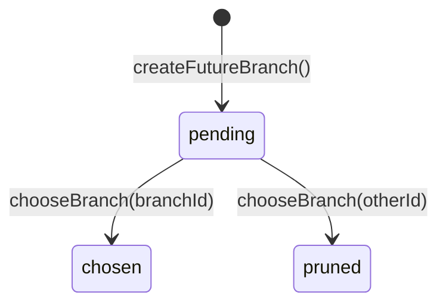

# BranchPoint 合同：因果链分叉治理

> 定义 BranchPoint + FutureBranch 的职责、接口、状态机、持久化层。
> 上游依赖：v13 §8.1-8.2（历史生成本体论 — 分叉治理）
> 关联实现：`core/branch-point.ts`、`core/branch-point-store.ts`

---

## §1 定义与边界

**BranchPoint** 标记因果链上的分叉位置：系统在此处面临多条候选路径，必须选择一条执行、剪除其余。

**FutureBranch** 描述 BranchPoint 下的每条候选路径：预测结果、风险、得分、状态。

**语义来源**：从 pipeline 的 `candidatePaths` / `chosenPath` / `failedPaths` 自然派生。每次 `recordFix` 产生多条候选时，pipeline 创建一个 BranchPoint + N 个 FutureBranch，选择得分最高者，剪除其余。

---

## §2 BranchPoint Schema

```yaml
BranchPoint:
  id: string                       # 格式: "BP_<random_hex_12>"
  episodeId: string                # 所属 Episode（lineage 锚点）
  locationDescription: string      # 分叉位置描述（人类可读）
  candidateCount: number           # 候选路径数量（= FutureBranch 数量）
  controllableFactors: string[]    # 可控因素（来自 context 中可干预的 keys）
  uncontrollableFactors: string[]  # 不可控因素
  chosenBranchId: string | null    # 最终选定的 FutureBranch ID
  createdAt: ISO8601
  createdBy: string                # "system" | 具体调用方标识
```

---

## §3 FutureBranch Schema

```yaml
FutureBranch:
  id: string                       # 格式: "FB_<random_hex_12>"
  branchPointId: string            # 所属 BranchPoint
  pathAtomIds: string[]            # 路径 Atom ID 列表
  predictedOutcome: string         # 预测结果描述
  riskProfile: string              # 风险描述
  score: number                    # 路径权重/得分
  status: BranchStatus             # 见 §4
  pruneReason?: string             # status=pruned 时的剪除原因
  createdAt: ISO8601
```

---

## §4 状态机



| 状态 | 语义 | 转入条件 |
|------|------|---------|
| `pending` | 候选未决 | 创建时默认状态 |
| `chosen` | 选中执行 | `chooseBranch` 指定该分支 |
| `pruned` | 剪除 | `chooseBranch` 指定其他分支后自动标记 |

**`chooseBranch` 语义**：接受一个 `chosenBranchId`，将该分支标为 `chosen`，将同 BranchPoint 下所有 `pending` 分支标为 `pruned`（附 `pruneReason`），同时更新 `BranchPoint.chosenBranchId`。

状态转换是**单向终态**：`chosen` 和 `pruned` 不可回退。

---

## §5 工厂函数

| 函数 | 签名 | 语义 |
|------|------|------|
| `createBranchPoint` | `(input: CreateBranchPointInput) => BranchPoint` | 生成 BranchPoint，`chosenBranchId` 初始为 null |
| `createFutureBranch` | `(input: CreateFutureBranchInput) => FutureBranch` | 生成 FutureBranch，默认 `status=pending` |
| `chooseBranch` | `(bp, branches, chosenBranchId, pruneReason?) => { branchPoint, branches }` | 执行选择 + 剪除，返回更新后的不可变副本 |

---

## §6 BranchPointStore 持久化层

SQLite（better-sqlite3）持久化层，WAL 模式。

### §6.1 存储 Schema

```sql
CREATE TABLE branch_points (
  id               TEXT PRIMARY KEY,
  episode_id       TEXT NOT NULL,
  candidate_count  INTEGER NOT NULL,
  chosen_branch_id TEXT,
  created_at       TEXT NOT NULL,
  data             TEXT NOT NULL          -- 完整 BranchPoint JSON
);
CREATE INDEX idx_bp_episode ON branch_points (episode_id);

CREATE TABLE future_branches (
  id               TEXT PRIMARY KEY,
  branch_point_id  TEXT NOT NULL,
  status           TEXT NOT NULL,
  score            REAL NOT NULL,
  created_at       TEXT NOT NULL,
  data             TEXT NOT NULL,          -- 完整 FutureBranch JSON
  FOREIGN KEY (branch_point_id) REFERENCES branch_points(id)
);
CREATE INDEX idx_fb_bp     ON future_branches (branch_point_id);
CREATE INDEX idx_fb_status ON future_branches (status);
```

### §6.2 接口

| 方法 | 签名 | 语义 |
|------|------|------|
| `saveBranchPoint` | `(bp: BranchPoint) => void` | INSERT OR REPLACE |
| `saveFutureBranch` | `(fb: FutureBranch) => void` | INSERT OR REPLACE |
| `getBranchPoint` | `(id: string) => BranchPoint \| null` | 按主键查询 |
| `getByEpisode` | `(episodeId: string) => BranchPoint[]` | 按 Episode 查询（created_at 升序） |
| `getBranches` | `(branchPointId: string) => FutureBranch[]` | 按 BranchPoint 查询所有分支（score 降序） |
| `getPrunedBranches` | `(limit?: number) => FutureBranch[]` | 查询所有被剪除的分支（用于失败边界审计），默认 limit=50 |
| `getStats` | `() => BranchPointStoreStats` | 返回 `{ branchPointCount, futureBranchCount }` |
| `close` | `() => void` | 关闭数据库连接 |

### §6.3 BranchPointStoreStats

```typescript
interface BranchPointStoreStats {
  branchPointCount: number;
  futureBranchCount: number;
}
```

---

## §7 不变量

| # | 不变量 | 违反时的后果 |
|---|--------|-------------|
| B1 | BranchPoint.candidateCount 必须等于其下 FutureBranch 数量 | 分叉结构不一致 |
| B2 | `chooseBranch` 后恰好一个分支为 `chosen`，其余全部 `pruned` | 分叉未决策完 |
| B3 | `chosen` / `pruned` 为终态，不可回退至 `pending` | 状态机违反 |
| B4 | `chosenBranchId` 非 null 时必须指向一个 status=chosen 的 FutureBranch | 悬空引用 |
| B5 | FutureBranch.branchPointId 必须指向已存在的 BranchPoint | 外键完整性 |
| B6 | `getByEpisode` 返回顺序为 created_at ASC | 调用方依赖时序 |
| B7 | `getBranches` 返回顺序为 score DESC | 调用方依赖排序 |

---

## §8 Pipeline 集成

BranchPointStore 作为 `CausalPipeline` 的 `readonly branchPoints` 字段暴露。Pipeline 构造时根据 `PipelineConfig.branchPointDbPath` 初始化。

```
CausalPipeline
  └── branchPoints: BranchPointStore
        ├── saveBranchPoint()  ← recordFix 多候选时调用
        ├── saveFutureBranch() ← 每条候选路径
        ├── getByEpisode()     ← 审计
        └── getPrunedBranches() ← 失败边界审计
```

---

## §9 v13 简化代理声明

当前实现为 v13 §8.1-8.2 的**简化代理**，与 v13 全 schema 存在以下差距：

| v13 全 schema 特性 | 当前状态 | Gap |
|-------------------|---------|-----|
| `counterfactualTrace`：每个 pruned 分支关联反事实推演记录 | 未实现 | FutureBranch 仅存 `pruneReason` 文本，无结构化反事实 |
| `temporalWindow`：分叉的时间窗口约束 | 未实现 | BranchPoint 无时间窗口字段 |
| `confidenceInterval`：每条分支的置信区间 | 未实现 | FutureBranch 仅有单一 `score`，无区间 |
| `cascadeEffect`：分支选择对下游 BranchPoint 的级联影响 | 未实现 | 当前各 BranchPoint 独立，无级联关系 |
| `revisionHistory`：BranchPoint 决策的修订历史 | 未实现 | 当前 `chosen`/`pruned` 为终态不可修订 |

升级路径：后续版本逐步引入上述字段，通过 schema 扩展（新增可选字段）保持向后兼容。

---

## §10 版本历史

| 版本 | 日期 | 变更 |
|------|------|------|
| 1 | 2026-04-15 | 初版。定义 BranchPoint + FutureBranch schema、状态机、BranchPointStore 持久化层、7 条不变量、v13 差距声明 |

---

## 参考

- [[reconstruction-contract|AcceptedReconstruction 合同]] — 姊妹，Reconstruction 与 BranchPoint 在 recordFix 中同步产生
- [[reconstruction-store-contract|ReconstructionStore 合同]] — 姊妹，同为 v11 治理对象持久化层
