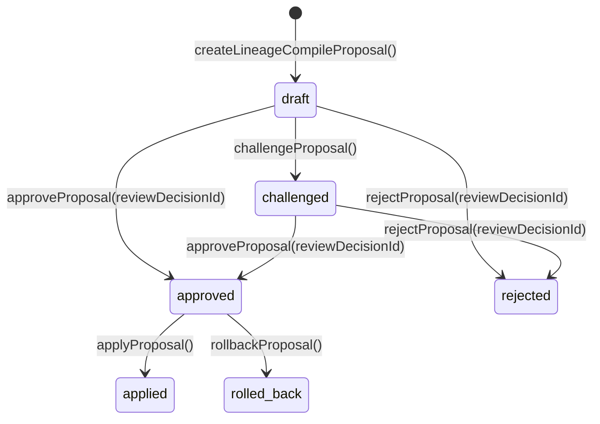

<!-- audit-ignore: describes-too-long -->

# LineageCompileProposal 合同：谱系编译提案

> v13 §11.1 Institutional Compile Layer 核心对象。定义编译提案的职责、状态机、Schema、不变量、持久化层。
> 上游依赖：PresentSlice（目标切片）、ReviewDecision（审批决定）
> 关联实现：`core/lineage-compile-proposal.ts`、`core/lineage-compile-proposal-store.ts`

---

## §1 职责

LineageCompileProposal 是 v13 谱系编译提案对象：记录一次 compile 操作的完整语境，包括为什么这条 lineage 值得编译、有哪些支持证据、有哪些已知反例和剪除分支。

**是什么**：
- 升级版 CompileProposal——绑定 PresentSlice，使编译操作与"当下是什么"明确关联
- 状态机驱动：draft → challenged → approved/rejected，approved → applied/rolled_back
- 记录 `proposedChanges`（Ref 权重变更列表），审批通过后由调用方执行

**不是什么**：
- 不执行 compile 操作本身——调用方在 `applyProposal` 后负责更新 Ref
- 不负责 review 决策逻辑——决策由 ReviewDecision 对象承载
- 不直接操作 AtomGraph——仅记录意图，执行由 pipeline 负责

---

## §2 状态机



| 状态 | 语义 | 终态 |
|------|------|------|
| `draft` | 提案草稿，待审核 | 否 |
| `challenged` | 受到质疑，待重新审核 | 否 |
| `approved` | 审批通过，待执行 | 否 |
| `rejected` | 审批拒绝 | **是** |
| `applied` | 已执行 compile | **是** |
| `rolled_back` | 已回滚 | **是** |

**初始状态固定为 `draft`**：`createLineageCompileProposal` 不接受自定义 status。

---

## §3 Schema

```typescript
interface LineageCompileProposal {
  id: string;                          // 格式: "LCP_<random_hex_12>"
  targetPresentSliceId: string;        // 目标 PresentSlice ID（不变量 LCP-1）
  proposedLineageId: string;           // 被提议编译的 ProvenanceLineage ID（不变量 LCP-2）
  supportingEpisodes: string[];        // 支撑 Episode ID（不变量 LCP-3：≥1）
  counterexampleIds: string[];         // 反例 ID（CounterexampleCommons 条目）
  prunedBranchRefs: string[];          // 已剪除的分支引用（v13 §11.2 条件 4）
  branchGovernanceImplications: string[]; // 分叉治理影响说明（v13 §11.2 条件 5）
  proposedChanges: ProposedRefChange[]; // 提议的 Ref 变更列表
  justification: string;               // 编译理由（不变量 LCP-4：非空）
  status: LineageCompileProposalStatus; // 不变量 LCP-5
  reviewDecisionId: string | null;     // approved/rejected 后填入
  reconstructionId: string | null;     // 编译依据的 AcceptedReconstruction
  createdAt: ISO8601;
  createdBy: string;
}

interface ProposedRefChange {
  refId: string;
  changeKind: 'add' | 'remove' | 'update_weight' | 'update_mode';  // 不变量 LCP-6
  beforeValue: string | null;    // 新增时为 null
  afterValue: string | null;     // 删除时为 null
}
```

---

## §4 工厂函数与状态转移函数

| 函数 | 签名 | 语义 |
|------|------|------|
| `createLineageCompileProposal` | `(input) => LineageCompileProposal` | 创建 draft 提案，自动校验 LCP-1 至 LCP-6 |
| `challengeProposal` | `(p) => LineageCompileProposal` | draft → challenged |
| `approveProposal` | `(p, reviewDecisionId) => LineageCompileProposal` | draft/challenged → approved，关联 ReviewDecision |
| `rejectProposal` | `(p, reviewDecisionId) => LineageCompileProposal` | draft/challenged → rejected，关联 ReviewDecision |
| `applyProposal` | `(p) => LineageCompileProposal` | approved → applied |
| `rollbackProposal` | `(p) => LineageCompileProposal` | approved → rolled_back |
| `transitionProposalStatus` | `(p, target, reviewDecisionId?) => LineageCompileProposal` | 通用状态转移，非法转移抛出异常 |

所有状态转移函数返回**不可变副本**（spread 更新），不修改原对象。

---

## §5 持久化层（LineageCompileProposalStore）

SQLite（better-sqlite3）持久化层，WAL 模式。

### §5.1 存储 Schema

```sql
CREATE TABLE lineage_compile_proposals (
  id                       TEXT PRIMARY KEY,
  target_present_slice_id  TEXT NOT NULL,
  proposed_lineage_id      TEXT NOT NULL,
  status                   TEXT NOT NULL,
  review_decision_id       TEXT,
  reconstruction_id        TEXT,
  created_at               TEXT NOT NULL,
  created_by               TEXT NOT NULL,
  data                     TEXT NOT NULL          -- 完整 JSON
);

CREATE INDEX idx_lcp_status  ON lineage_compile_proposals (status);
CREATE INDEX idx_lcp_slice   ON lineage_compile_proposals (target_present_slice_id);
CREATE INDEX idx_lcp_lineage ON lineage_compile_proposals (proposed_lineage_id);
```

### §5.2 接口

| 方法 | 签名 | 语义 |
|------|------|------|
| `save` | `(p: LineageCompileProposal) => void` | INSERT OR REPLACE，写入前重新校验不变量 |
| `get` | `(id: string) => LineageCompileProposal \| null` | 按主键精确查询 |
| `listByPresentSlice` | `(sliceId: string) => LineageCompileProposal[]` | 按 PresentSlice 查询（created_at ASC） |
| `listByLineage` | `(lineageId: string) => LineageCompileProposal[]` | 按 lineage ID 查询（created_at ASC） |
| `listByStatus` | `(status: string, limit?: number) => LineageCompileProposal[]` | 按状态查询（created_at DESC），默认 limit=100 |
| `listAll` | `(limit?: number) => LineageCompileProposal[]` | 全量（created_at DESC），默认 limit=100 |
| `getStats` | `() => LineageCompileProposalStoreStats` | 返回 `{ total, byStatus }` |
| `close` | `() => void` | 关闭数据库连接 |

### §5.3 LineageCompileProposalStoreStats

```typescript
interface LineageCompileProposalStoreStats {
  total: number;
  byStatus: Record<string, number>;   // 各状态的计数
}
```

---

## §6 不变量

| # | 不变量 | 违反时的后果 |
|---|--------|-------------|
| LCP-1 | `targetPresentSliceId` 非空 | 编译操作失去"当下"锚点 |
| LCP-2 | `proposedLineageId` 非空 | 编译操作无法关联 lineage |
| LCP-3 | `supportingEpisodes` 至少一个（v13 §11.2 条件 1） | 无证据支撑的 compile 不合法 |
| LCP-4 | `justification` 非空 | 编译理由缺失 |
| LCP-5 | `status` 必须在合法值集合内 | 状态机违反 |
| LCP-6 | `proposedChanges` 中每条 `changeKind` 合法 | 变更类型未知 |
| LCP-7 | 状态转移必须遵循许可表 | 非法转移抛出异常 |
| LCP-8 | `rejected`/`applied`/`rolled_back` 为终态，不可继续转移 | 状态机终态保证 |
| LCP-9 | `save` 在写入前重新调用 `assertValidLineageCompileProposal` | 持久化层双重校验 |

---

## §7 v13 编译条件对应关系

| v13 §11.2 条件 | 对应字段 |
|---------------|---------|
| 1. 有 positioned observations 支持 | `supportingEpisodes` (LCP-3) |
| 2. 有 replay 或 equivalent reconstruction 支持 | `reconstructionId` |
| 3. 有最小充分性论证 | `justification` (LCP-4) |
| 4. 有已知 pruned branches 的引用 | `prunedBranchRefs` |
| 5. 有对 future branch governance 的说明 | `branchGovernanceImplications` |
| 6. 若涉及跨本体，必须有 lineage convergence 审理 | 调用方职责，本对象不强制 |

---

## §8 版本历史

| 版本 | 日期 | 变更 |
|------|------|------|
| 1 | 2026-04-16 | 初版。定义 LineageCompileProposal Schema、状态机、6 个状态转移函数、LineageCompileProposalStore、9 条不变量 |

---

## 参考

- [[present-slice-contract|PresentSlice 合同]] — `targetPresentSliceId` 指向 PresentSlice
- [[compile-promotion-contract|Compile 晋升合同]] — 前身，定义 Ref compile 规则（不含 lineage 绑定）
- [[review-decision-contract|ReviewDecision 合同]] — approved/rejected 时关联 ReviewDecision
- [[reconstruction-contract|AcceptedReconstruction 合同]] — `reconstructionId` 指向 Reconstruction
