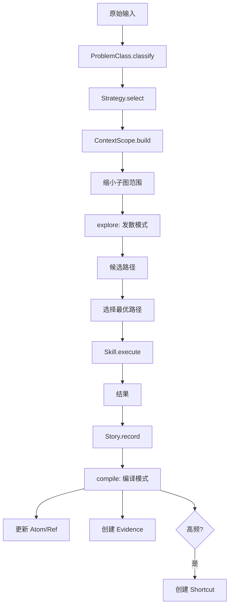

# BestQ-A 元模型：当前语义合同

> 本文档是系统的**唯一语义底座**。所有代码、表结构、MCP 工具名必须与本文档对齐。
> 不是 v6，而是 v1-v5 的收束。

---

## 0. 五个并列模块

```
┌──────────────┐  ┌──────────────┐  ┌──────────────┐  ┌──────────────┐  ┌──────────────┐
│ ProblemClass │  │  Strategy    │  │    Skill     │  │  Story/Case  │  │ Atom/Ref/    │
│  (是什么)    │  │  (怎么想)    │  │  (怎么做)    │  │  (经历了什么) │  │  Shortcut    │
│              │  │              │  │              │  │              │  │  (知道什么)   │
│  问题本体论  │  │  理解协议    │  │  执行结构    │  │  学习样本    │  │  图真相层    │
│  (v2)        │  │  (v3)        │  │  (v1/v4)     │  │  (新增)      │  │  (v5)        │
└──────┬───────┘  └──────┬───────┘  └──────┬───────┘  └──────┬───────┘  └──────┬───────┘
       │                 │                 │                 │                 │
       │    classify     │  contextualize  │    execute      │    compile      │
       └────────→────────┴────────→────────┴────────→────────┴────────→────────┘
```

**关键约束**：每个模块独立建模，不互相吞并。`ProblemClass` 不是 Atom，`Skill` 不是 ActionAtom，`Story` 不是 Event。

---

## 1. ProblemClass — 问题本体论

### 是什么

对"这是什么类型的问题"的抽象分类。**不是图搜索的副作用，而是图搜索之前的先验约束。**

```typescript
interface ProblemClass {
  id: string;                    // "PC_null_deref"
  name: string;                  // "空指针解引用类问题"
  description: string;
  signatures: string[];          // 匹配特征：["AttributeError", "NoneType", "null", "undefined"]
  defaultStrategy: string;       // 默认策略 ID
  subgraphConstraint: string;    // 图查询时的子图约束条件
}
```

### 不是什么

- 不是 Atom（不在图中被 Ref 连接）
- 不是 tag/label（它有自己的匹配逻辑和策略绑定）
- 不是 Regulation（它不描述因果，只描述归类）

### 在系统中的位置

```
输入 → ProblemClass.classify() → 缩小子图范围 → explore()
```

ProblemClass 是**路由器**，决定了 explore 在图的哪个区域搜索，而非搜索整个图。

---

## 2. Strategy / Archetype — 理解协议

### 是什么

收到问题后"怎么理解、怎么检索"的思考协议。来自 v3 的语义接龙。

```typescript
interface Strategy {
  id: string;                    // "STR_diagnose_error"
  name: string;                  // "错误诊断策略"
  steps: StrategyStep[];         // 有序步骤
  applicableTo: string[];        // 适用的 ProblemClass IDs
}

interface StrategyStep {
  phase: 'classify' | 'contextualize' | 'constrain' | 'retrieve' | 'execute';
  description: string;
  toolHint?: string;             // 建议使用的 MCP 工具名
}
```

### 不是什么

- 不是可执行代码（那是 Skill 的职责）
- 不是因果规则（那是 Ref 的职责）
- 不是 Composite Tree（v4 的组合树映射到 Strategy + Skill 的组合）

### 典型实例

```
Strategy: "错误诊断"
  Step 1: classify — 这是什么类型的错误？
  Step 2: contextualize — 在什么技术栈/版本下发生？
  Step 3: constrain — 缩小到相关子图
  Step 4: retrieve — 在子图中 explore 候选路径
  Step 5: execute — 按最高权重路径执行修复 Skill
```

---

## 3. Skill — 可执行技能

### 是什么

具有明确输入输出契约的可执行操作。v1 的原子任务 + v4 的 Atom 中的执行部分。

```typescript
interface Skill {
  id: string;                    // "SKL_add_null_check"
  name: string;                  // "添加空指针检查"
  description: string;

  // 执行契约
  inputs: SkillParam[];          // 输入参数
  outputs: SkillParam[];         // 输出
  sideEffects: boolean;          // 是否有副作用
  idempotent: boolean;           // 是否幂等
  autoExecutable: boolean;       // 是否允许自动执行（vs 需要人工确认）

  // 绑定
  boundAtomId?: string;          // 关联的 ACTION Atom（知识层面的"建议"）
  toolBinding?: string;          // 绑定的 MCP 工具或 CLI 命令
}

interface SkillParam {
  name: string;
  type: string;
  description: string;
  required: boolean;
}
```

### 不是什么

- 不是 ACTION Atom（Atom 是知识层面的"建议"，Skill 是执行层面的"能力"）
- 不是 Strategy step（Strategy 说"该做什么"，Skill 说"怎么做"）

### 与 Atom 的关系

```
ActionAtom("add null check") ← 知识：这是一个可能的修复建议
          ↓ boundAtomId
Skill("SKL_add_null_check")  ← 执行：输入 file+line，输出 patch，可自动执行
```

图能告诉你"add null check"是个修复动作，Skill 让系统知道怎么真正去做。

---

## 4. Story / Case — 学习样本

### 是什么

一次完整的"遇到问题 → 尝试解释 → 实际修复"的全过程记录。compile 的输入不是抽象图操作，而是具体的 Case。

```typescript
interface Story {
  id: string;                    // "STORY_20260410_001"

  // 输入
  rawInput: string;              // 原始问题描述
  problemClassId: string;        // 归类结果
  context: ContextScope;         // 上下文快照

  // 过程
  observationAtomIds: string[];  // 观测拆解出的 Atom IDs
  candidatePaths: PathResult[];  // 发散模式产生的候选路径
  chosenPath?: PathResult;       // 最终选择的路径
  executedSkillIds: string[];    // 实际执行的 Skill IDs

  // 结果
  outcome: 'success' | 'partial' | 'failure' | 'abandoned';
  outcomeNotes?: string;

  // 元数据
  operator: string;              // 操作者（人/agent）
  createdAt: string;
  resolvedAt?: string;
}
```

### 不是什么

- 不是 Event（Event 是"未解释的观测"，Story 是完整闭环的案例）
- 不是 Regulation（Regulation 是 compiled Ref 的视图，Story 是学习样本）

### 与 compile 的关系

```
compile 不直接面对抽象图，而是面对具体的 Story：

Story.chosenPath  → compile: 强化这条路径
Story.candidatePaths - chosenPath → compile: 弱化未选路径
Story.outcome == 'failure' → compile: 弱化 chosenPath
```

**图是知识，Story 是学习样本。两者分开后，系统会稳很多。**

---

## 5. Atom / Ref / Shortcut — 图真相层

### 5.1 Atom — 知识节点

不可再分的单一事实/概念。**SSOT：修改即传播。**

```typescript
interface Atom {
  id: string;
  content: string;
  kind: AtomKind;
  canonicalKey: string;         // 规范化 key，用于同义去重
  refCount: number;
}

enum AtomKind {
  FACT        // 观测事实（不可执行）
  CONCEPT     // 抽象概念（不可执行）
  ACTION      // 修复建议（知识层面，不直接执行 → 需绑定 Skill）
  CONTEXT     // 环境上下文（作为 ContextScope 的一部分）
  PATTERN     // 模式标签
  CONJUNCTION // 合取节点（A && B）
}
```

**写权限**：任何模块可创建 Atom，但只有 compile 可以删除（通过 prune）。

### 5.2 Ref — 引用边

卡片之间的关系。**关系本身就是知识。**

```typescript
interface Ref {
  id: string;
  fromAtomId: string;
  toAtomId: string;
  kind: RefKind;
  weight: number;               // 0.0-1.0
  mode: 'tentative' | 'compiled';
  provenance: RefProvenance;    // 来源追溯
  contextScope: ContextScope;   // 此关系成立的上下文条件
  evidenceIds: string[];        // 支撑此关系的 Evidence IDs
}
```

**写权限**：
- explore 可创建 `tentative` 边
- compile 可升级为 `compiled` 或删除
- 手动添加标记为 `provenance: 'manual'`

**失效规则**：
- 修改 Ref.kind → 依赖此 Ref 的 Shortcut 全部失效
- 删除 Ref → 两端 Atom.refCount 自动减 1
- 删除 Atom → 级联删除所有关联 Ref

### 5.3 Shortcut — 编译缓存

高频路径的压缩。**不是一等因果事实，是 cache。**

```typescript
interface Shortcut {
  id: string;
  fromAtomId: string;
  toAtomId: string;
  viaPath: string[];            // 完整中间路径（必须保留）
  derivedFromRefIds: string[];  // 来源 Ref IDs（溯源）
  applicableIf: ContextScope;   // 适用条件
  stalenessScore: number;       // 0.0-1.0，越高越可能过期
  invalidatedAt?: string;       // 失效时间戳
}
```

**硬约束**：
- Shortcut 只能加速检索，不能直接提高底层因果置信度
- Shortcut 必须保留 `viaPath` 和 `derivedFromRefIds`
- 底层 Ref 被修改或删除时，相关 Shortcut 自动标记失效
- Shortcut 不可直接写入真相层（只能由 myelinate 创建）

---

## 6. Evidence — 一等证据

### 是什么

支撑一条 Ref 存在的具体证据。不是计数器，是可溯源的一等对象。

```typescript
interface Evidence {
  id: string;
  refId: string;                // 所支撑的 Ref

  sourceType: 'observation' | 'test' | 'fix' | 'user_confirmed' | 'benchmark';
  sourceId: string;             // Story ID / Test ID / Fix commit
  contextSnapshot: ContextScope; // 证据产生时的上下文
  supportsOrContradicts: 'supports' | 'contradicts';
  reproducible: boolean;
  confidence: number;           // 0.0-1.0
  capturedAt: string;
}
```

### 价值

有了 Evidence，系统可以回答：
- 这条边**为什么**存在？→ `Evidence.sourceId`
- 它在**哪些上下文**里成立？→ `Evidence.contextSnapshot`
- 是**谁**验证过？→ `Evidence.sourceType`
- 有**哪些反例**？→ `supportsOrContradicts == 'contradicts'`

没有这层，compiled Ref 会变成"系统好像知道，但说不清凭什么知道"。

---

## 7. ContextScope — 作用域系统

### 是什么

不是 AtomKind，是结构化的条件谓词。

```typescript
interface ContextScope {
  env?: string;                 // dev / prod / ci
  stack?: string[];             // ["django", "postgresql", "linux"]
  version?: string;             // "django>=4.0"
  timeRange?: {                 // 此知识的有效时间窗口
    from?: string;
    to?: string;
  };
  project?: string;             // 项目/租户
  custom?: Record<string, unknown>; // 扩展字段
}
```

### 用途

```
Ref:      A causes B under {stack: ["django"], env: "prod"}
Shortcut: A → D applicable_if {stack: ["django"]}
Evidence: 在 {env: "prod", version: "4.2"} 下观测到 A→B
```

**ContextScope 让"A causes B"从普适真理变成有条件的命题。**

---

## 8. 运行时流程



**关键**：`classify → contextualize → constrain subgraph → explore`，不是 `raw input → whole graph search`。

---

## 9. 系统不变量

以下约束在任何情况下不可违反：

| 不变量 | 说明 |
|--------|------|
| **图是唯一写模型** | 所有知识变更先落 Atom/Ref，再物化为 Regulation 视图 |
| **Regulation 只是读视图** | 不可直接手工维护 Regulation 表，它是 compiled Ref 的投影 |
| **Shortcut 不可写入真相层** | Shortcut 是缓存，不是因果事实，只由 myelinate 创建 |
| **compile 只能基于 Story/Evidence** | 不可凭空强化/弱化 Ref，必须有具体案例支撑 |
| **删除 Ref 必须联动 Shortcut 失效** | 底层 Ref 变动时，依赖的 Shortcut 自动标记 invalidatedAt |
| **ProblemClass 在图外** | ProblemClass 是路由器，不是 Atom，不被 Ref 连接 |
| **Atom 写自由，删受限** | 任何模块可创建 Atom，只有 prune（基于 compile 结果）可删除 |
| **Evidence 不可篡改** | Evidence 是 append-only 日志，只增不改不删 |

---

## 10. 关键指标

| 指标 | 含义 | 健康范围 |
|------|------|---------|
| `problem_class_router_accuracy` | ProblemClass 归类准确率 | > 80% |
| `atom_dedup_precision` | Atom 去重精度（同义合并正确率） | > 90% |
| `orphan_atom_rate` | 孤立卡片比例（refCount=0） | < 20% |
| `explore_branching_factor` | 发散模式平均候选路径数 | 3-15 |
| `compile_acceptance_rate` | compile 后保留的路径比例 | 30-70% |
| `shortcut_hit_rate` | 探索时直接命中 Shortcut 的比例 | 随使用逐步上升 |
| `contradiction_rate` | 同一 Ref 上的矛盾证据比例 | < 10% |
| `evidence_freshness_coverage` | 有近 30 天 Evidence 的 compiled Ref 占比 | > 50% |

---

## 11. 与代码的映射

| 元模型对象 | 当前代码位置 | 状态 |
|-----------|-------------|------|
| Atom / Ref / Shortcut | `core/atom-graph.ts` | ✅ 已实现（含 canonicalKey 去重、provenance、contextScope、CONJUNCTION） |
| Evidence | `core/evidence.ts` | ✅ 已实现（append-only EvidenceStore，支撑/反驳/摘要/健康检查） |
| Story / Case | `core/story.ts` | ✅ 已实现（完整生命周期、compile 服务接口、ContextScope 工具函数） |
| ProblemClass | `core/problem-class.ts` | ✅ 已实现（6 种子分类、签名匹配、子图约束） |
| Strategy | `core/problem-class.ts` | ✅ 已实现（步骤化协议、与 ProblemClass 绑定） |
| Skill | `core/skill.ts` | ✅ 已实现（SkillRegistry、执行契约、种子数据、执行统计） |
| ContextScope | `core/story.ts` (结构化接口 + 工具函数) | ✅ 已实现（scopeContains/Overlaps/Merge） |
| Regulation (view) | `core/regulation-view.ts` | ✅ 已实现（RegulationViewBuilder：从 compiled Ref 投影，兼容旧接口） |
| RefAlgebra | `core/ref-algebra.ts` | ✅ 已实现（四族分类、复合规则、RefForce、EvidencePolicy、proof-carrying） |
| PatternTemplate | `core/pattern-template.ts` | ✅ 已实现（小范畴模板、SlotFingerprint、InvariantCheck、canCompile 门控） |
| Hypothesis | `core/hypothesis.ts` | ✅ 已实现（一等假设对象、InterventionOutcome、canPromote 门控） |
| Pipeline | `core/pipeline.ts` | ✅ 已实现（CausalPipeline：submit→classify→explore→compile 闭环编排） |

### 局部合同

| 合同 | 文件 | 管辖 |
|------|------|------|
| RefAlgebra 合同 | `current/ref-algebra-contract.md` | 复合规则、force 约束、evidencePolicy、proof 失效 |
| Template 不变量合同 | `current/template-invariant-contract.md` | SlotFingerprint、InvariantCheck、模板生命周期、涌现治理 |
