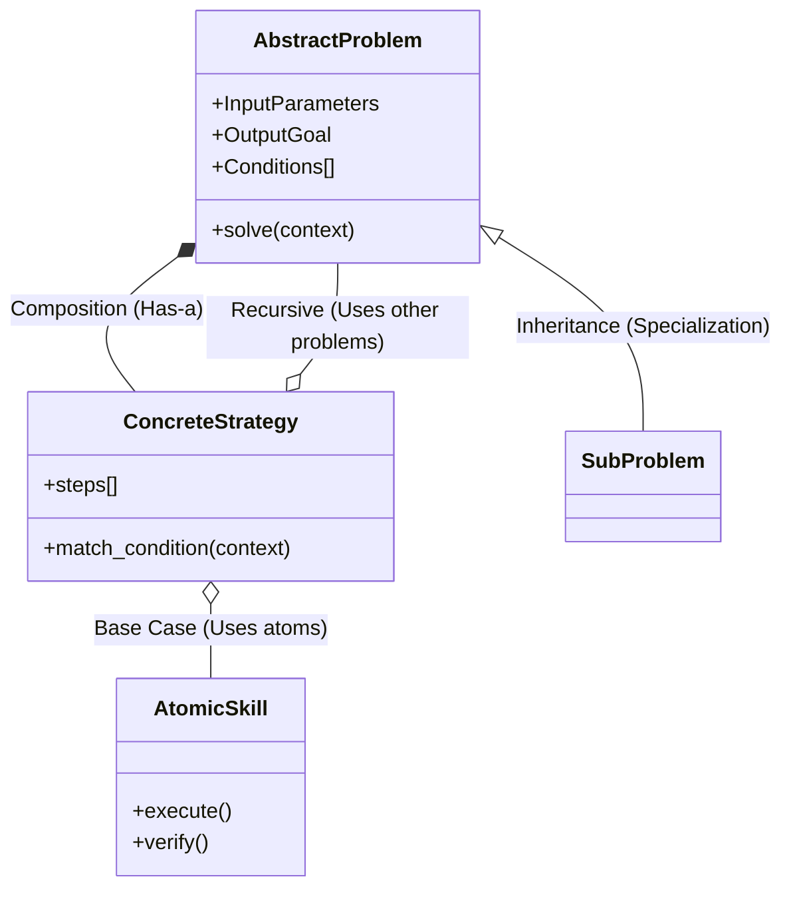

# 递归式问答 (Recursive Q&A) 系统设计 v2

## 1. 核心理念 (Core Philosophy): 面向抽象的各种问题 (Abstraction-Oriented Problem Solving)

**用户核心洞察**：

1.  **本质是组合 (Composition)**：所有类型的问题，本质上都是由"更基础类的问题"组合而成的。
2.  **抽象即因果 (Abstraction as Causality)**：所谓的"因果"（Causal），本质上是从大量具体的 Q&A 中，**抽象**出共同的"问题模版"（Problem Class）。
    - _具体问题_：为什么 10.0.1.5 连接超时？
    - _抽象问题_：如何诊断 TCP 连接超时？(这是"因" - 通用的道理)
3.  **条件即答案 (Conditions determine Answers)**：对于一个定义清晰的"问题类"，最重要的不是唯一的答案，而是**根据不同条件 (Conditions)** 路由到不同的解答 (Solution)。

---

## 2. 概念模型 (Conceptual Model)

我们不再仅仅关注"任务分解"，而是关注建立一个**问题的类型系统 (Type System for Problems)**。

### 2.1 抽象类 (Problem Class)

定义一类问题的"接口"和"抽象本质"。

- **Signature (签名)**: 输入参数、输出目标。
- **Abstraction Level**: 位于抽象层级的哪一层（L0: 基础原子 -> L10: 复杂业务）。

### 2.2 实例 (Problem Instance)

具体的、发生在这个世界上的真实 Q&A 记录。通常是我们数据的起点。

### 2.3 解答策略 (Solution Strategy)

针对某个 Problem Class 的具体实现方法。一个 Problem Class 可以有多个 Strategies，通过 Condition 选择。

---

## 3. 数据结构设计

### 3.1 问题类定义 (The Schema)

```yaml
# 这是一个抽象的问题类 (Abstract Class)
class_id: "PC_Network_Connectivity"
name: "网络连通性问题"
description: "两个端点之间无法经由 TCP/UDP 通信"

# 输入参数抽象
parameters:
  - source_ip
  - dest_ip
  - port
  - protocol

# 核心：根据条件路由到不同的基础问题组合
solutions:
  - condition: "target_is_domain_name == True"
    strategy: "DNS_Resolution_First"
    composition:
      - step_1: "PC_DNS_Resolve" # 引用更基础的问题类
      - step_2: "PC_Ping_Check"

  - condition: "is_cloud_environment == True"
    strategy: "Security_Group_Check"
    composition:
      - step_1: "PC_Check_AWS_SecurityGroup" # 引用基础问题
      - step_2: "PC_Check_NACL"

  - condition: "default"
    strategy: "Standard_TCP_Handshake_Check"
    composition:
      - step_1: "PC_Local_Route_Check"
      - step_2: "PC_Remote_Port_Check"
```

### 3.2 具体 Q&A 实例 (The Instance)

这是我们在数据库中"存储"的东西。它记录了一次具体的应用。

```yaml
instance_id: "QA_20260114_001"
problem_class_ref: "PC_Network_Connectivity" # 实例化自哪个抽象类

# 具体上下文 (Context/Conditions)
context:
  source_ip: "192.168.1.10"
  dest_ip: "10.0.0.5"
  is_cloud_environment: true

# 实际采用的路径
applied_strategy: "Security_Group_Check"

# 结果/现象
outcome:
  success: false
  error: "Security Group rule missing for port 80"

# 验证 (Verification) - 用于证明这个 Q&A 是对的
verification:
  cmd: "aws ec2 describe-security-groups --group-ids sg-123"
  evidence: "Ingress rule for port 80 not found"
```

---

## 4. "因果"与"抽象"的进化循环

这是系统的核心动力：**从具体 (Detailed) 到 抽象 (Abstract)** 的升维过程。

1.  **记录 (Record)**: 一开始，数据库里可能只有大量零散的、具体的 Q&A（都在描述具体的 Bug，如 Redis 连不上、MySQL 连不上）。
2.  **抽象 (Abstract)**: 我们观察到 "Redis 连不上" 和 "MySQL 连不上" 都有共同的特征（IP、端口、鉴权）。
3.  **重构 (Refactor)**:
    - 创建一个新的抽象类 `PC_Remote_Service_Access`。
    - 将具体的 Redis/MySQL 问题定义为该类的子类或实例。
    - **提取共同条件**：发现 "防火墙拦截" 是这这两类问题共有的 _Condition_。
4.  **复用 (Reuse)**: 下次再遇到 "PostgreSQL 连不上"，直接继承 `PC_Remote_Service_Access`，自动获得 "检查防火墙" 这一基础能力。

此即用户所做：**“Causal 本质上是去抽象出共同的抽象类”**。

---

## 5. 架构图谱



## 6. 价值总结

通过强制将问题“归类”：

1.  我们不再是解决一个孤立的 Bug，而是在完善**问题类型的本体论 (Ontology)**。
2.  **解答 (A)** 不再是死板的步骤，而是**基于条件 (Conditions) 的动态路由**。
3.  **验证 (V)** 变得标准化：因为它是针对抽象类的验证，可以覆盖所有实例。
