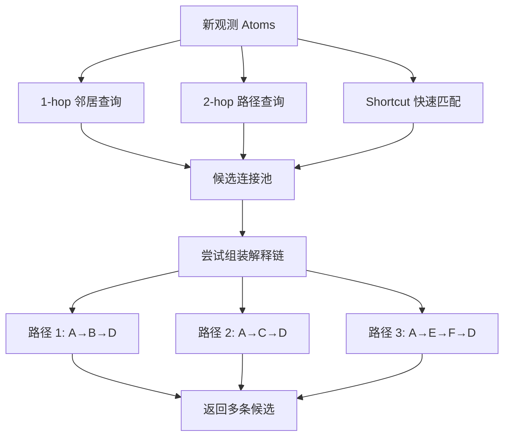
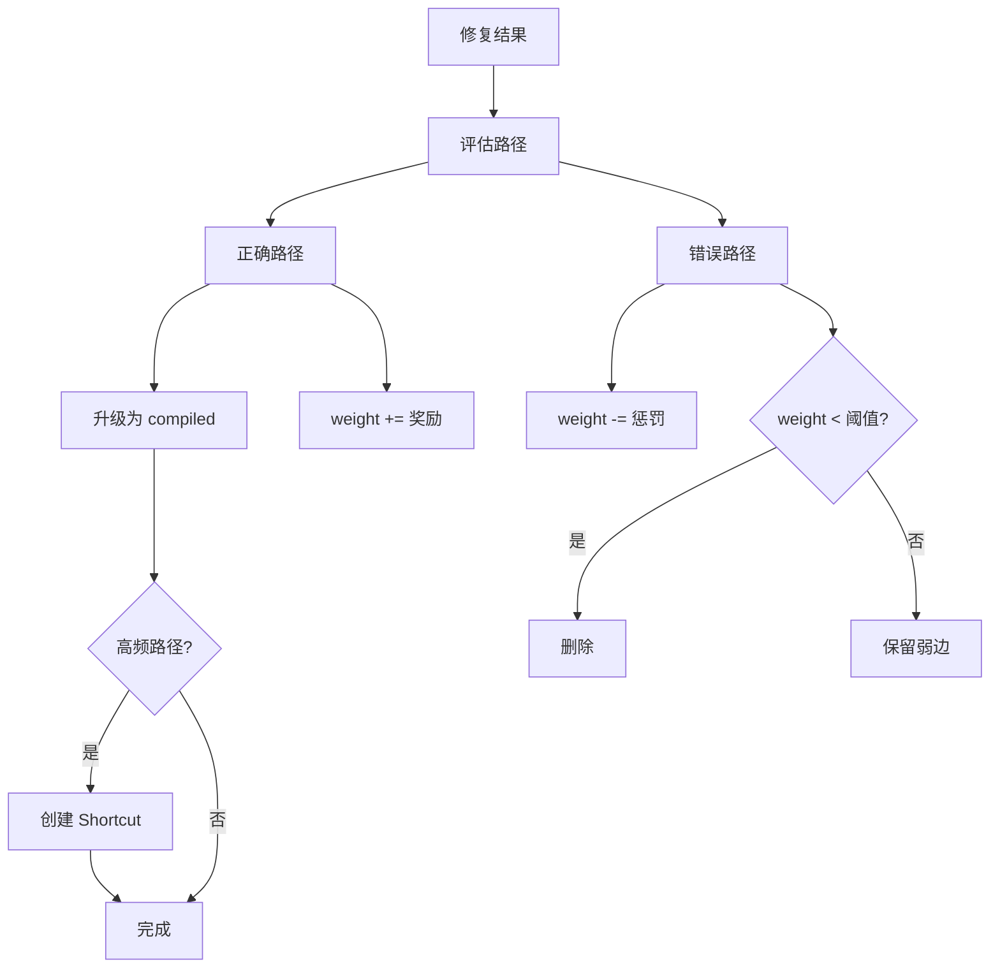

# 递归式问答 (Recursive Q&A) 系统设计 v5: 卡片盒 + 双模式引擎

## 1. 核心隐喻：卡片盒 × 髓鞘化 (Zettelkasten × Myelination)

知识不是一条条规则，而是一张**图**：节点是原子事实，边是引用关系。

- **改节点** = 修正一个事实，所有引用处自动同步（SSOT）
- **改边** = 改对现实世界关系的理解，图结构更趋同构于真实

解决问题不是"匹配规则"，而是**在图上找路径**：

- **发散模式**：广撒网，在已有卡片间尝试建立连接，产生多条候选解释
- **编译模式**：留下最正确的路径，强化为高速公路（髓鞘化）

```
数据 ←→ 数据类型
Atom ←→ Ref
事实 ←→ 关系
```

数据是具体的，类型是结构性的。改数据修正一个点，改类型重塑整个理解框架。

---

## 2. 三层架构

```
┌─────────────────────────────────────┐
│  接口层: Regulation / MCP 输出       │  对外兼容、人类可读摘要
├─────────────────────────────────────┤
│  流程层: Observation / Event / Story │  运行时推理、状态流转
├─────────────────────────────────────┤
│  真相层: Atom / Ref / Shortcut       │  知识底座、SSOT、图结构
└─────────────────────────────────────┘
```

**图模型负责真相，规则模型负责解释，事件模型负责流程。**

各层关系：
- Atom 不替代 Fact — Fact 是观测输入，Atom 是去重落盘后的知识节点
- Ref 不替代 Regulation — Regulation 是一组 compiled Ref 的可读视图
- Event 保留为"待解释问题包"、"发散阶段的候选路径容器"

---

## 3. 真相层数据模型

### 3.1 Atom（原子卡片）

不可再分的单一事实或概念。全局去重，修改即传播。

```typescript
interface Atom {
  id: string;              // "atom_a3f2"
  content: string;         // 原子内容
  kind: AtomKind;
  refCount: number;        // 被引用次数 = 热度
  createdAt: string;
  updatedAt: string;
}

enum AtomKind {
  FACT = 'fact',           // "segfault in solver.cpp"
  CONCEPT = 'concept',     // "null pointer dereference"
  ACTION = 'action',       // "add null check before deref"
  CONTEXT = 'context',     // "C++ / Linux / Release build"
  PATTERN = 'pattern',     // "off-by-one", "race-condition"
}
```

### 3.2 Ref（引用边）

卡片之间的关系。**关系本身就是知识**，不是附属信息。

```typescript
interface Ref {
  id: string;
  fromAtomId: string;
  toAtomId: string;
  kind: RefKind;
  weight: number;          // 0.0-1.0 强度（髓鞘化程度）
  evidence: number;        // 验证次数
  mode: 'tentative' | 'compiled';
  createdAt: string;
  lastUsedAt: string;
}

enum RefKind {
  // 因果
  CAUSES = 'causes',           // A 导致 B
  PREVENTS = 'prevents',       // A 阻止 B
  REQUIRES = 'requires',       // A 需要 B 作为前提
  // 结构
  IS_A = 'is_a',               // A 是 B 的一种
  PART_OF = 'part_of',         // A 是 B 的组成部分
  SIMILAR_TO = 'similar_to',   // A 与 B 相似
  // 操作
  FIXES = 'fixes',             // Action A 修复 Fact B
  INDICATES = 'indicates',     // Fact A 暗示 Concept B
  COOCCURS = 'cooccurs',       // A 和 B 经常同时出现
}
```

### 3.3 Shortcut（快捷边 / 髓鞘化高速公路）

高频路径的压缩缓存。`A→B→C→D` 被反复验证后，自动建 `A→D`。

```typescript
interface Shortcut {
  id: string;
  fromAtomId: string;
  toAtomId: string;
  viaPath: string[];       // 中间经过的 atom IDs
  totalWeight: number;     // 路径累计权重
  useCount: number;
  createdAt: string;
}
```

---

## 4. 双模式运行机制

### 4.1 发散模式（Explore）

触发：遇到新问题，现有编译态知识无法直接解释。



规则：
- 所有新建的边标记为 `mode: 'tentative'`
- 不做最终选择，返回所有可行路径
- tentative 边暂时保留，等编译模式裁决

### 4.2 编译模式（Compile）

触发：问题解决后（record_fix），或用户主动整理。



规则：
- 正确路径上的每条 Ref：`weight += 0.1`，`evidence += 1`，`mode = 'compiled'`
- 错误路径上的 tentative Ref：`weight -= 0.05`
- `weight < 0.1` 的边被删除
- 路径 `use_count >= 3` 时触发髓鞘化（创建 Shortcut）

---

## 5. SSOT 传播机制

```
修改 Atom.content
  → 所有引用该 Atom 的 Ref 看到的内容自动更新
  → 零冗余，零手动同步

修改 Ref.kind（如 causes → cooccurs）
  → 世界模型更新：从"A 导致 B"变为"A 与 B 只是相关"
  → 依赖该 Ref 的所有 Shortcut 失效，需重新验证

删除 Atom
  → 所有关联 Ref 级联删除
  → 受影响的 Shortcut 失效

删除 Ref
  → 两端 Atom.refCount 自动减 1
  → refCount = 0 的 Atom 成为孤立卡片（待清理或待发现新连接）
```

---

## 6. 与前代设计的映射

| v4 概念 | v5 映射 | 关系 |
|---------|---------|------|
| Observation.facts | 一组 Atom (kind=fact) | 输入拆解 |
| Regulation.pre | 一组 Ref (kind=requires) | 视图投影 |
| Regulation.eff | 一组 Ref (kind=causes) | 视图投影 |
| Event (open) | 一组 tentative Ref 的容器 | 发散产物 |
| Event (resolved) | 一组 compiled Ref | 编译产物 |
| confirmed Regulation | compiled Ref 集合的可读摘要 | 接口层 |
| Atom (knowledge_base) | Atom (kind=concept/action) | 直接对应 |
| Composite Tree | Shortcut 路径 | 髓鞘化路径 |
| 80/19/1 法则 | Shortcut(80%) / explore(19%) / new Atom(1%) | 自然映射 |

---

## 7. MCP 工具设计

### 真相层（Atom/Ref 操作）

| 工具 | 作用 | 模式 |
|------|------|------|
| `add_atom` | 创建原子卡片 | 通用 |
| `add_ref` | 创建引用边 | 通用 |
| `update_atom` | 修改卡片内容（自动传播） | 通用 |
| `update_ref` | 修改引用类型或权重 | 通用 |
| `query_graph` | 图查询：邻居、路径、模式 | 通用 |

### 流程层（发散/编译）

| 工具 | 作用 | 模式 |
|------|------|------|
| `explore` | 从观测出发，发散搜索候选路径 | 发散 |
| `compile` | 强化正确路径，削弱错误路径 | 编译 |
| `myelinate` | 为高频路径建 Shortcut | 编译 |
| `prune` | 清理弱边和孤立卡片 | 编译 |

### 接口层（兼容现有）

| 工具 | 作用 | 说明 |
|------|------|------|
| `submit_observation` | 提交观测 → 自动拆解为 Atoms + explore | 保留，增强 |
| `record_fix` | 记录修复 → 自动 compile | 保留，增强 |
| `suggest_causes` | 查因 → 走 Shortcut 或 explore | 保留，增强 |
| `list_regulations` | 返回 compiled Ref 集合的可读视图 | 保留，投影 |

---

## 8. 设计哲学总结

```
v1: 递归分解（树）
v2: 抽象归类（集合）
v3: 语义接龙（链）
v4: 组合引擎（Atom + Composite 分离）
v5: 卡片盒 + 髓鞘化（图 + 双模式）
```

从 v1 到 v5 的演化轨迹：

```
树 → 集合 → 链 → 分层 → 图
```

v5 的核心主张：
- **信息本身（Atom）和信息被引用的方式（Ref）是两种独立的知识**
- **发散产生可能性，编译沉淀确定性**
- **高频路径自动髓鞘化，知识越用越快**
- **SSOT 消除冗余，改一处即改全局**
