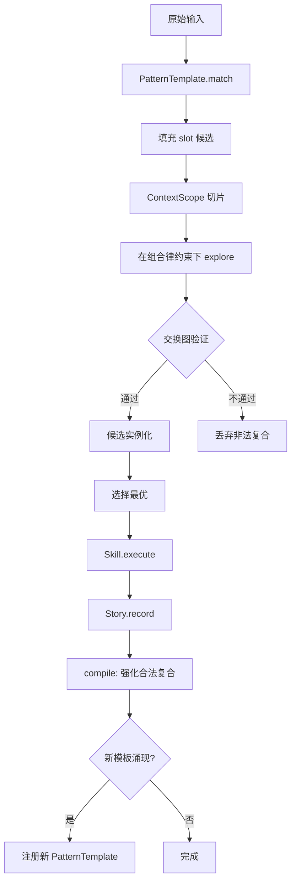

# 递归式问答 (Recursive Q&A) 系统设计 v6: 关系范畴引擎

## 1. 核心隐喻：从图到范畴 (From Graph to Category)

v5 建了一张 typed graph（Atom/Ref/Shortcut）。v6 升级为**有组合律的关系范畴**。

```
图只有连接，范畴还有组合。
```

- **图**：A→B 存在，B→C 存在，但 A→C 是否合法未定义
- **范畴**：A→B 和 B→C 能否复合为 A→C，取决于态射的签名和组合律

v5 的 Explore 在图上枚举路径，Compile 固化高频路径，Shortcut 缓存复合通路。
v6 给这些操作加上**法律**：哪些复合合法，哪些禁止，哪些需要降级。

---

## 2. 范畴学翻译表

| 现有元素 | 范畴学翻译 | 工程作用 |
|---------|-----------|---------|
| Atom | 对象 | 边界稳定的知识单位 |
| Ref | 态射 | 关系本身就是知识 |
| Shortcut | 复合态射缓存 | 高频路径被编译 |
| ProblemClass / PatternTemplate | 小范畴模板 | 可反复实例化的结构 |
| Explore | 合法路径生成 | 在组合律约束下发散找候选 |
| Compile | 证据驱动的固化 | 形成稳定复合态射 |
| Story / Case | 函子实例 | 小范畴到事实图的保结构映射 |

---

## 3. RefType 系统：态射的签名和组合律

### 3.1 四族分类

```
structural    (结构层)：is_a, part_of       — 稳定闭包，表达"是什么"
explanatory   (解释层)：causes, requires    — 候选机制链，表达"为什么"
evidential    (证据层)：indicates, cooccurs, similar_to — 召回和提示，不是因果
interventional(干预层)：fixes, prevents     — 与解释层配对形成可验证 action chain
```

### 3.2 复合规则（组合律）

**核心约束：`indicates ∘ causes` 不能直接压成 `causes`**，否则征兆被误编译为根因。

```
A --causes--> B --causes--> C    →  A --causes--> C        (因果可传递)
A --requires-> B --causes--> C   →  A --requires-> C       (前提传递)
A --fixes----> B --causes--> C   →  A --fixes--> C         (修复可跨层)

A --indicates-> B --causes-> C   →  FORBIDDEN              (征兆≠根因)
A --cooccurs--> B --causes-> C   →  FORBIDDEN              (共现≠因果)
A --similar_to-> B --fixes-> C   →  A --fixes-> C [candidate]  (需验证)

A --is_a-----> B --causes-> C    →  A --causes-> C [inherit]   (子类继承因果)
A --part_of--> B --causes-> C    →  FORBIDDEN               (部分≠整体因果)
```

### 3.3 RefType 声明

```typescript
interface RefTypeSpec {
  kind: RefKind;
  family: 'structural' | 'explanatory' | 'evidential' | 'interventional';
  domKinds: AtomKind[];          // 允许的源 Atom 类型
  codKinds: AtomKind[];          // 允许的目标 Atom 类型
  directional: boolean;
  symmetric: boolean;
  transitive: boolean | 'candidate'; // true=自由传递, 'candidate'=需验证
  composeRules: ComposeRule[];
}

interface ComposeRule {
  with: RefKind;                 // 与什么类型的边复合
  position: 'before' | 'after'; // 本边在前还是在后
  result: RefKind | 'forbidden' | 'candidate';
  mode?: RefMode;                // 结果边的模式
  note?: string;
}
```

---

## 4. PatternTemplate：小范畴模板

### 4.1 从 ProblemClass 升级

v5 的 ProblemClass 是"一组签名关键词"。v6 升级为**带结构的小范畴**。

```typescript
interface PatternTemplate {
  id: string;
  name: string;
  description: string;

  // 对象槽位（角色）
  slots: PatternSlot[];

  // 态射约束（箭头）
  arrows: PatternArrow[];

  // 不变量（交换图约束）
  invariants?: string[];

  // 上下文模式
  contextSchema?: Record<string, unknown>;

  // 编译阈值
  compileThreshold: number;      // 几次成功实例化后可固化
}

interface PatternSlot {
  role: string;                  // "Symptom" | "Mechanism" | "Failure" | "Action"
  atomKinds: AtomKind[];         // 允许填入的 Atom 类型
  description: string;
}

interface PatternArrow {
  from: string;                  // slot role
  to: string;                    // slot role
  refKind: RefKind;
  minWeight?: number;
}
```

### 4.2 典型模板

```
诊断模板 (DiagnosticPattern):
  Symptom --indicates--> Mechanism --causes--> Failure
  Action  --fixes------> Mechanism

依赖模板 (DependencyPattern):
  Module --requires--> Dependency --part_of--> System
  MissingDep --causes--> ImportError

升级模板 (UpgradePattern):
  OldVersion --causes--> Bug
  NewVersion --fixes--> Bug
  NewVersion --is_a--> OldVersion
```

### 4.3 实例化 = 函子

一次具体 Case 就是 PatternTemplate → 事实图的保结构映射：

```
模板：    Symptom → Mechanism → Failure
                    ↑
                    Action

实例化：  "连接超时" → "安全组缺失 5432" → "RDS 不可达"
                       ↑
                       "放开 5432 入站"
```

Redis/MySQL/PostgreSQL 连不上，是同一个模板的不同实例，而非三个文本相似的 case。

---

## 5. 升级后的运行时流程



**关键变化**：
- Explore 不再盲目遍历全图，而是在 PatternTemplate 约束下填充 slot
- Compile 时检查复合规则，`indicates ∘ causes` 被阻止而非被压缩
- 高频成功的实例化集合可以涌现为新的 PatternTemplate

---

## 6. 模式识别的四件事

### 6.1 关系指纹

不看节点名字像不像，看入边/出边/常见两跳三跳路径是否同构。

```
Role(X) ≈ 入边签名 + 出边签名 + 可达路径签名
```

一个概念值得升级为抽象对象，不是因为常出现，而是因为关系角色稳定。

### 6.2 汇合点

多个症状的解释链总是汇到同一个机制节点 → 该节点值得提升为更高层抽象。

### 6.3 保结构的跨域映射

数据库连不上和支付失败可能没有任何相同词汇，但如果都满足：
```
Symptom → Mechanism → Failure
Action → Mechanism
```
则它们是同一模式族的两个实例。

### 6.4 交换图验证

抽象模式是否靠谱，看：经由"归类→标准策略→修复"的路径，和经由"本地特例排查→修复"的路径，是否长期导向同一结果。能交换 = 结构稳定，不能交换 = 语义幻觉。

---

## 7. 设计演化轨迹

```
v1: 递归分解（树）
v2: 抽象归类（集合）
v3: 语义接龙（链）
v4: 组合引擎（Atom + Composite 分离）
v5: 卡片盒 + 髓鞘化（图 + 双模式）
v6: 关系范畴引擎（有组合律的图 + 小范畴模板）
```

从 v1 到 v6：

```
树 → 集合 → 链 → 分层 → 图 → 范畴
```

v6 的核心主张：
- **不要把模式当标签，要把模式当小范畴**
- **不要把关系当边注释，要把关系当有签名、有组合律、有验证约束的态射**
- **一旦箭头有了法律，模式会自己浮出来**

---

## 8. v6.1 修正：关系语义硬化 + 分层 + proof-carrying

基于外部审查反馈的关键修正。

### 8.1 关系强度维度（force）

`causes/requires/fixes` 混着多种语义强度。给每条 Ref 增加 force 维度：

```typescript
type RefForce = 'necessary' | 'sufficient' | 'contributory' | 'analogical';
```

- `necessary`：A 是 B 的必要条件
- `sufficient`：A 足以导致 B
- `contributory`：A 促成 B 但不充分
- `analogical`：A 和 B 有结构类比但非因果

**复合规则受 force 约束**：`contributory ∘ contributory` 不能升级为 `sufficient`。

### 8.2 认识论 vs 世界模型分层

```
世界模型层：causes, requires, fixes, prevents, is_a, part_of
  → 描述世界本身
  → 可以生成 compiled Ref

认识论层：indicates, cooccurs, similar_to
  → 描述"观察如何提示解释"
  → 跨层复合的结果不是 Ref，而是 Hypothesis / CandidatePath
```

**核心规则**：evidential → explanatory 产生**候选解释**，不产生 Ref。只有经过 Story + Evidence + compile 后才能进入 compiled Ref。

### 8.3 富复合结果（proof-carrying inference）

```typescript
interface CompositionResult {
  status: 'compiled' | 'candidate' | 'forbidden';
  resultKind?: string;
  resultForce?: RefForce;
  mergedScope?: ContextScope;        // 上下文能否统一
  evidencePolicy: 'inherit' | 'revalidate' | 'discard';
  proof: DerivationStep[];           // 推导步骤（可回放、可失效）
}

interface DerivationStep {
  refId: string;
  kind: string;
  force: RefForce;
  weight: number;
}
```

### 8.4 PatternSlot 指纹约束

`atomKinds` 不够区分角色（Symptom 和 Failure 都是 FACT）。增加关系指纹：

```typescript
interface SlotFingerprint {
  inboundRefKinds?: string[];     // 期望的入边类型
  outboundRefKinds?: string[];    // 期望的出边类型
  isConvergencePoint?: boolean;   // 是否是多条路径的汇合点
  minInDegree?: number;
  minOutDegree?: number;
}
```

### 8.5 可执行不变量

交换图验证从描述变为可执行断言：

```typescript
interface InvariantCheck {
  id: string;
  description: string;
  severity: 'hard' | 'soft';      // hard 不过 → 不能 compile
  evaluate: (bindings: Record<string, string>, refChecker: RefChecker) => {
    passed: boolean;
    reason?: string;
  };
}
```

### 8.6 术语修正

更准确的定位：**typed relation algebra with partial composition**，而非严格范畴。保留范畴学作为设计灵感，实现用朴素命名。
